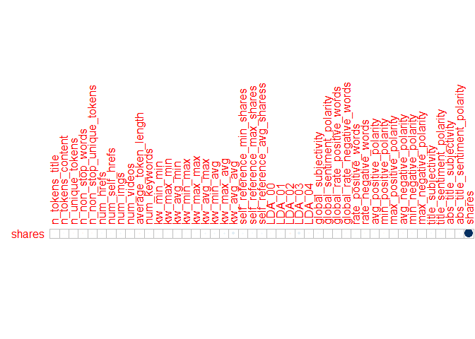
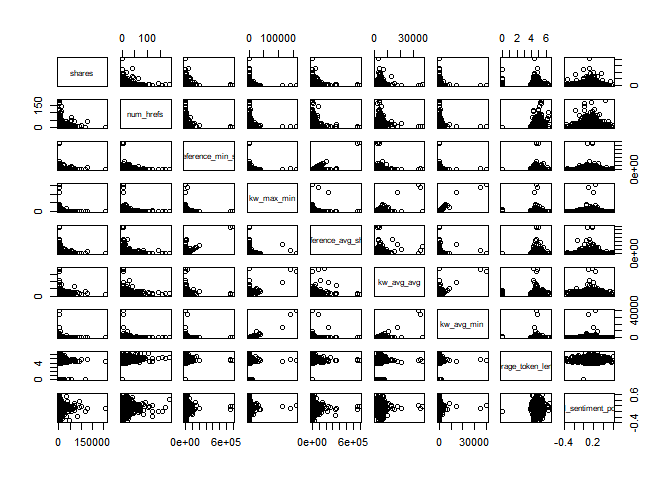
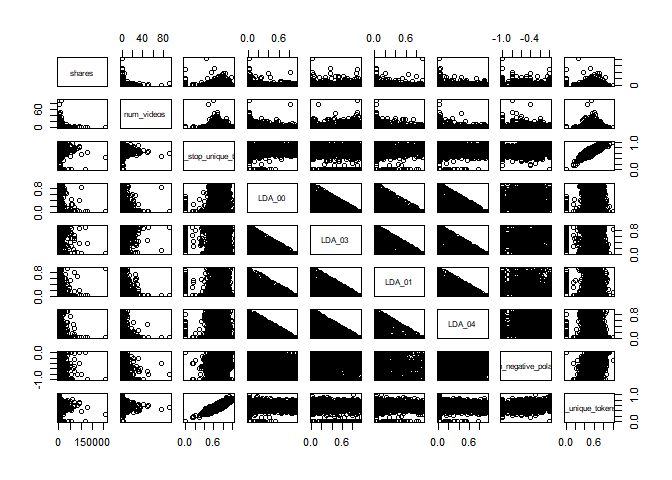

Project 2
================
Jackie Steffan
10/16/2020

``` r
#load in required packages
library(tidyverse)
library(corrplot)
library(ggplot2)
library(GGally)
library(tree)
library(caret)
library(gbm)
library(rpart)
library(rmarkdown)
```

# Introduction

This data set looks at articles that were published on the website
Mashable. The articles included were published over a 2 year period. The
goal of the data set was to look at the frequency of sharing and the
popularity of each article. According to the data documentation, the
variables url and timedelta are non-predicitve, so I chose not to use
them.  
This analysis is intended to predict the number of shares an article
will have based on other factors such as word count, number of pictures,
etc. I am using 2 tree methods that you will see later in this document.
One is a non-ensemble regression tree and the other is a bosoted tree.

# Data

In this section I am reading in the data described above.  
I then separate the data into a training data set that contains 70% of
the data and a testing data set that contains the remaining 30% of the
data.

``` r
#read in data
popData <- read_csv("./OnlineNewsPopularity.csv")
```

    ## Parsed with column specification:
    ## cols(
    ##   .default = col_double(),
    ##   url = col_character()
    ## )

    ## See spec(...) for full column specifications.

``` r
#combine boolean varaibles to make them easier to work with using mutate
popData <- popData %>% mutate(weekday = ifelse(weekday_is_monday == 1, "Monday", 
                                    ifelse(weekday_is_tuesday == 1, "Tuesday",
                                           ifelse(weekday_is_wednesday==1, "Wednesday",
                                                  ifelse(weekday_is_thursday==1, "Thursday",
                                                         ifelse(weekday_is_friday==1, "Friday",
                                                                ifelse(weekday_is_saturday==1, "Saturday", "Sunday"))))))) %>%
  mutate(channel_type = ifelse(data_channel_is_lifestyle == 1, "Lifestyle",
                               ifelse(data_channel_is_entertainment ==1, "Entertainment",
                                      ifelse(data_channel_is_bus ==1, "Business",
                                             ifelse(data_channel_is_socmed ==1, "Social Media",
                                                    ifelse(data_channel_is_tech == 1, "Tech",
                                                           ifelse(data_channel_is_world ==1, "World", "Other"))))))) %>%
                                    select(-starts_with("weekday_is"), -starts_with("data_channel"))

#filter to select appropriate weekday
weekdayDat <- filter(popData, weekday== params$weekday)

#set seed for reproducibility
set.seed(5)
#split into training and test sets
train <- sample(1:nrow(weekdayDat), size = nrow(weekdayDat)*0.7)
test <- dplyr::setdiff(1:nrow(weekdayDat), train)
DayTrain <- weekdayDat[train, ]
DayTest <- weekdayDat[test, ]
```

# Summarization

Here I am creating summaries for all the predictive variables that are
numeric, the summaries included are min, max, median, mean, and the
first and 3rd quantiles. I am also including a correlation plot that
shows the correlation between our response variable, shares, and the
other predictive numeric variables. Lastly I included a pairs plot of
the response variable and some other predictive variables, which shows
what the 2 variables look like plotted against one another.

``` r
#summary of numeric variables
summary(select(DayTrain,-c("url", "weekday", "timedelta", "channel_type", "is_weekend")))
```

    ##  n_tokens_title  n_tokens_content n_unique_tokens  n_non_stop_words n_non_stop_unique_tokens   num_hrefs      num_self_hrefs      num_imgs      
    ##  Min.   : 3.00   Min.   :   0.0   Min.   :0.0000   Min.   :0.0000   Min.   :0.0000           Min.   :  0.00   Min.   : 0.000   Min.   :  0.000  
    ##  1st Qu.: 9.00   1st Qu.: 240.0   1st Qu.:0.4752   1st Qu.:1.0000   1st Qu.:0.6294           1st Qu.:  4.00   1st Qu.: 1.000   1st Qu.:  1.000  
    ##  Median :10.00   Median : 403.0   Median :0.5448   Median :1.0000   Median :0.6960           Median :  7.00   Median : 2.000   Median :  1.000  
    ##  Mean   :10.38   Mean   : 526.6   Mean   :0.5353   Mean   :0.9704   Mean   :0.6784           Mean   : 10.74   Mean   : 3.033   Mean   :  4.264  
    ##  3rd Qu.:12.00   3rd Qu.: 691.0   3rd Qu.:0.6136   3rd Qu.:1.0000   3rd Qu.:0.7610           3rd Qu.: 13.00   3rd Qu.: 4.000   3rd Qu.:  3.000  
    ##  Max.   :23.00   Max.   :7413.0   Max.   :1.0000   Max.   :1.0000   Max.   :1.0000           Max.   :186.00   Max.   :51.000   Max.   :108.000  
    ##    num_videos     average_token_length  num_keywords      kw_min_min       kw_max_min         kw_avg_min        kw_min_max       kw_max_max    
    ##  Min.   : 0.000   Min.   :0.000        Min.   : 1.000   Min.   : -1.00   Min.   :     0.0   Min.   :   -1.0   Min.   :     0   Min.   : 28000  
    ##  1st Qu.: 0.000   1st Qu.:4.475        1st Qu.: 6.000   1st Qu.: -1.00   1st Qu.:   448.2   1st Qu.:  139.7   1st Qu.:     0   1st Qu.:843300  
    ##  Median : 0.000   Median :4.662        Median : 7.000   Median : -1.00   Median :   663.5   Median :  234.8   Median :  1500   Median :843300  
    ##  Mean   : 1.256   Mean   :4.550        Mean   : 7.206   Mean   : 26.04   Mean   :  1114.2   Mean   :  312.4   Mean   : 13865   Mean   :754862  
    ##  3rd Qu.: 1.000   3rd Qu.:4.857        3rd Qu.: 9.000   3rd Qu.:  4.00   3rd Qu.:  1000.0   3rd Qu.:  352.9   3rd Qu.:  7700   3rd Qu.:843300  
    ##  Max.   :91.000   Max.   :6.486        Max.   :10.000   Max.   :217.00   Max.   :158900.0   Max.   :39979.0   Max.   :843300   Max.   :843300  
    ##    kw_avg_max       kw_min_avg     kw_max_avg       kw_avg_avg      self_reference_min_shares self_reference_max_shares
    ##  Min.   :  5911   Min.   :   0   Min.   :  2195   Min.   :  776.1   Min.   :     0.0          Min.   :     0.0         
    ##  1st Qu.:174386   1st Qu.:   0   1st Qu.:  3569   1st Qu.: 2374.2   1st Qu.:   629.2          1st Qu.:   995.8         
    ##  Median :245753   Median :1057   Median :  4373   Median : 2853.8   Median :  1200.0          Median :  2700.0         
    ##  Mean   :260610   Mean   :1125   Mean   :  5670   Mean   : 3147.6   Mean   :  4152.9          Mean   : 11232.7         
    ##  3rd Qu.:331472   3rd Qu.:2051   3rd Qu.:  6030   3rd Qu.: 3597.5   3rd Qu.:  2700.0          3rd Qu.:  7600.0         
    ##  Max.   :843300   Max.   :3584   Max.   :171030   Max.   :37607.5   Max.   :690400.0          Max.   :843300.0         
    ##  self_reference_avg_sharess     LDA_00            LDA_01            LDA_02            LDA_03            LDA_04        global_subjectivity
    ##  Min.   :     0             Min.   :0.01818   Min.   :0.01818   Min.   :0.01818   Min.   :0.01818   Min.   :0.01819   Min.   :0.0000     
    ##  1st Qu.:   935             1st Qu.:0.02504   1st Qu.:0.02501   1st Qu.:0.02857   1st Qu.:0.02540   1st Qu.:0.02857   1st Qu.:0.3967     
    ##  Median :  2169             Median :0.03337   Median :0.03334   Median :0.04006   Median :0.04000   Median :0.04001   Median :0.4553     
    ##  Mean   :  6760             Mean   :0.17925   Mean   :0.13864   Mean   :0.23004   Mean   :0.22773   Mean   :0.22435   Mean   :0.4444     
    ##  3rd Qu.:  5100             3rd Qu.:0.23368   3rd Qu.:0.15005   3rd Qu.:0.37678   3rd Qu.:0.37874   3rd Qu.:0.37033   3rd Qu.:0.5093     
    ##  Max.   :690400             Max.   :0.92699   Max.   :0.91940   Max.   :0.92000   Max.   :0.92554   Max.   :0.92653   Max.   :0.8987     
    ##  global_sentiment_polarity global_rate_positive_words global_rate_negative_words rate_positive_words rate_negative_words avg_positive_polarity
    ##  Min.   :-0.36425          Min.   :0.00000            Min.   :0.000000           Min.   :0.0000      Min.   :0.0000      Min.   :0.0000       
    ##  1st Qu.: 0.05608          1st Qu.:0.02802            1st Qu.:0.009767           1st Qu.:0.5968      1st Qu.:0.1921      1st Qu.:0.3049       
    ##  Median : 0.11522          Median :0.03874            Median :0.015246           Median :0.7078      Median :0.2857      Median :0.3571       
    ##  Mean   : 0.11738          Mean   :0.03915            Mean   :0.016768           Mean   :0.6781      Mean   :0.2924      Mean   :0.3529       
    ##  3rd Qu.: 0.17550          3rd Qu.:0.04973            3rd Qu.:0.021973           3rd Qu.:0.8000      3rd Qu.:0.3889      3rd Qu.:0.4107       
    ##  Max.   : 0.60000          Max.   :0.13699            Max.   :0.136929           Max.   :1.0000      Max.   :1.0000      Max.   :1.0000       
    ##  min_positive_polarity max_positive_polarity avg_negative_polarity min_negative_polarity max_negative_polarity title_subjectivity
    ##  Min.   :0.0000        Min.   :0.0000        Min.   :-1.0000       Min.   :-1.0000       Min.   :-1.0000       Min.   :0.0000    
    ##  1st Qu.:0.0500        1st Qu.:0.6000        1st Qu.:-0.3312       1st Qu.:-0.7000       1st Qu.:-0.1250       1st Qu.:0.0000    
    ##  Median :0.1000        Median :0.8000        Median :-0.2571       Median :-0.5000       Median :-0.1000       Median :0.1250    
    ##  Mean   :0.0965        Mean   :0.7472        Mean   :-0.2618       Mean   :-0.5208       Mean   :-0.1105       Mean   :0.2825    
    ##  3rd Qu.:0.1000        3rd Qu.:1.0000        3rd Qu.:-0.1875       3rd Qu.:-0.3000       3rd Qu.:-0.0500       3rd Qu.:0.5000    
    ##  Max.   :1.0000        Max.   :1.0000        Max.   : 0.0000       Max.   : 0.0000       Max.   : 0.0000       Max.   :1.0000    
    ##  title_sentiment_polarity abs_title_subjectivity abs_title_sentiment_polarity     shares      
    ##  Min.   :-1.00000         Min.   :0.0000         Min.   :0.0000               Min.   :    22  
    ##  1st Qu.: 0.00000         1st Qu.:0.1667         1st Qu.:0.0000               1st Qu.:   966  
    ##  Median : 0.00000         Median :0.5000         Median :0.0000               Median :  1400  
    ##  Mean   : 0.06756         Mean   :0.3464         Mean   :0.1537               Mean   :  3193  
    ##  3rd Qu.: 0.13636         3rd Qu.:0.5000         3rd Qu.:0.2500               3rd Qu.:  2700  
    ##  Max.   : 1.00000         Max.   :0.5000         Max.   :1.0000               Max.   :210300

``` r
#correlation of selected variables
cors <- cor(select(DayTrain, -url, -timedelta, -weekday, -channel_type, -is_weekend))
#correlation plot showing just correlation with the response variable shares
corrplot(cors["shares",,drop=FALSE], type = "upper", tl.pos = "lt",cl.pos = "n")
```

<!-- -->

``` r
#pairs data with selected variables
pairs(select(DayTrain, shares, num_hrefs, self_reference_min_shares, kw_max_min, self_reference_avg_sharess, kw_avg_avg, kw_avg_min, average_token_length, global_sentiment_polarity))
```

<!-- -->

``` r
pairs(select(DayTrain, shares,num_videos, n_non_stop_unique_tokens, LDA_00, LDA_03, LDA_01, LDA_04, min_negative_polarity, n_unique_tokens))
```

<!-- -->

# Models

In this section I am creating 2 tree models. The first is a non-ensemble
based tree selected using leave one out cross-validation. I am also
using cp between 0 and 0.2 for my tuning parameter. The final model is
printed below.  
The second model is a boosted tree selected using repeated cross
validation and the default tuning parameters. The final model is also
printed in the output.  
Lastly, you will find a comparison of RMSE, when deciding which model is
the “better” model you should select the one that has the lower RMSE.

``` r
#select relevant datapoints
treeDat <- select(DayTrain,-c("url", "weekday", "is_weekend", "timedelta"))
#build regression tree using rpart and train using LOOCV and tuning parameter cp
classTree <- train(shares~., data= select(DayTrain,-url, -weekday, -is_weekend, -timedelta), 
                   method= "rpart",
                   trControl = trainControl(method = "LOOCV"),
                   tuneGrid = data.frame(cp=0:0.2),
                   metric = "MAE")
#print results of tree
classTree$results
```

    ##   cp     RMSE    Rsquared      MAE
    ## 1  0 8464.278 0.002225897 3359.156

``` r
#predict the number of shares on the test dataset using the above tree
pred<- predict(classTree, newdata = select(DayTest, -c("url", starts_with("weekday_is"), "is_weekend")))
#calculate RMSE
trRMSE<- sqrt(mean((pred-DayTest$shares)^2))


#boosted model
#build boosted tree using gbm and train with repeated cross validation and default tuning parameters.
gbmGrid <-  expand.grid(interaction.depth = c(1, 5, 9), 
                        n.trees = (1:3)*50, 
                        shrinkage = c(0.1, 0.2),
                        n.minobsinnode = c(10,20))
boostTree <- train(shares ~ ., data = treeDat, method = "gbm",
                   trControl = trainControl(method = "repeatedcv", number = 10, repeats = 5),
                   preProcess = c("center", "scale"), verbose = FALSE,
                   tuneGrid = gbmGrid)
#print results of boosted tree
boostTree$results
```

    ##    shrinkage interaction.depth n.minobsinnode n.trees     RMSE   Rsquared      MAE   RMSESD RsquaredSD    MAESD
    ## 1        0.1                 1             10      50 7146.156 0.02160367 2799.769 2040.166 0.02198485 231.5107
    ## 4        0.1                 1             20      50 7092.739 0.02870299 2785.664 2056.466 0.02818113 230.1524
    ## 19       0.2                 1             10      50 7182.034 0.02208384 2817.839 2020.358 0.01993103 222.2774
    ## 22       0.2                 1             20      50 7114.888 0.03063034 2806.858 2048.047 0.02886201 225.1710
    ## 7        0.1                 5             10      50 7164.084 0.03160075 2821.215 2013.268 0.02928066 223.6830
    ## 10       0.1                 5             20      50 7109.977 0.03595286 2798.416 2037.299 0.03144419 228.4382
    ## 25       0.2                 5             10      50 7293.108 0.02901891 2928.534 1979.995 0.02615419 245.5185
    ## 28       0.2                 5             20      50 7235.497 0.02878823 2917.988 1976.004 0.02529029 241.4170
    ## 13       0.1                 9             10      50 7213.223 0.03012596 2865.452 1975.204 0.02336097 209.6822
    ## 16       0.1                 9             20      50 7132.935 0.03549677 2827.987 2027.254 0.02794967 236.4428
    ## 31       0.2                 9             10      50 7452.215 0.02220217 3071.693 1970.618 0.02103229 263.5037
    ## 34       0.2                 9             20      50 7334.435 0.02428670 3055.296 1963.958 0.02218800 250.3155
    ## 2        0.1                 1             10     100 7164.098 0.02369650 2808.368 2023.538 0.02195091 223.1580
    ## 5        0.1                 1             20     100 7109.734 0.02995099 2798.583 2051.708 0.02967213 230.4237
    ## 20       0.2                 1             10     100 7177.023 0.02506903 2822.073 2017.375 0.02227209 226.6154
    ## 23       0.2                 1             20     100 7119.741 0.03076181 2809.169 2052.108 0.02724301 230.5201
    ## 8        0.1                 5             10     100 7211.936 0.03037801 2849.669 2000.485 0.02750468 226.0058
    ## 11       0.1                 5             20     100 7155.112 0.03575650 2846.752 2029.734 0.03294993 242.3692
    ## 26       0.2                 5             10     100 7422.464 0.02598556 3055.311 1970.888 0.02398568 245.5291
    ## 29       0.2                 5             20     100 7336.084 0.02703197 3052.927 1953.873 0.02265321 248.7107
    ## 14       0.1                 9             10     100 7287.852 0.02952782 2941.783 1955.292 0.02616573 224.9985
    ## 17       0.1                 9             20     100 7199.242 0.03442464 2922.865 2008.833 0.03049024 242.8526
    ## 32       0.2                 9             10     100 7622.324 0.02009435 3281.841 1921.696 0.01952308 277.4598
    ## 35       0.2                 9             20     100 7435.257 0.02562554 3245.714 1908.491 0.02141688 254.6977
    ## 3        0.1                 1             10     150 7156.274 0.02555911 2806.997 2020.066 0.02305074 222.5902
    ## 6        0.1                 1             20     150 7111.953 0.03050459 2798.881 2047.885 0.02902493 226.3731
    ## 21       0.2                 1             10     150 7181.152 0.02631921 2818.705 2014.371 0.02367809 224.9236
    ## 24       0.2                 1             20     150 7131.926 0.03098057 2828.723 2051.150 0.02761725 233.5146
    ## 9        0.1                 5             10     150 7258.050 0.02938607 2893.301 1988.248 0.02684480 219.4649
    ## 12       0.1                 5             20     150 7205.806 0.03261806 2894.143 2013.625 0.03005627 234.1377
    ## 27       0.2                 5             10     150 7515.949 0.02597359 3162.197 1951.722 0.02681543 241.9382
    ## 30       0.2                 5             20     150 7407.091 0.02741796 3168.471 1954.742 0.02299847 265.9638
    ## 15       0.1                 9             10     150 7351.699 0.02892271 3012.994 1943.409 0.02660225 221.5135
    ## 18       0.1                 9             20     150 7253.003 0.03380510 2994.860 1995.858 0.03139831 244.4685
    ## 33       0.2                 9             10     150 7720.905 0.01918270 3416.807 1915.660 0.01987281 277.7956
    ## 36       0.2                 9             20     150 7548.997 0.02405816 3395.974 1899.889 0.02308376 256.3138

``` r
#print best tree
boostTree$bestTune
```

    ##   n.trees interaction.depth shrinkage n.minobsinnode
    ## 4      50                 1       0.1             20

``` r
#predict number of shares on the test data set using the boosted tree
boostPred <- predict(boostTree, newdata = select(DayTest, -c("url", starts_with("weekday_is"), "is_weekend")), n.trees = 5000)
#calculate RMSE
boostRMSE<- sqrt(mean((boostPred-DayTest$shares)^2))


#print RMSE for both models and compare results.
c(tree = trRMSE, boost = boostRMSE)
```

    ##      tree     boost 
    ## 10235.729  9475.092
