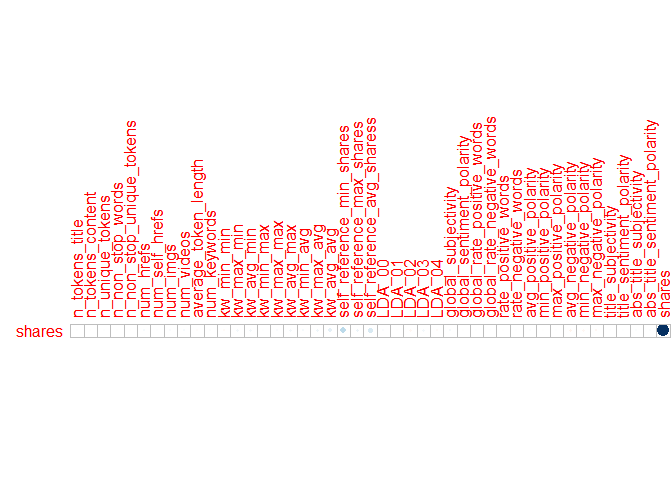
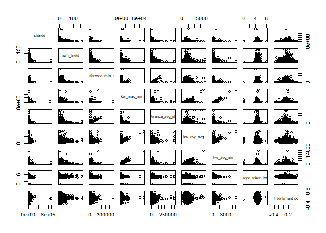
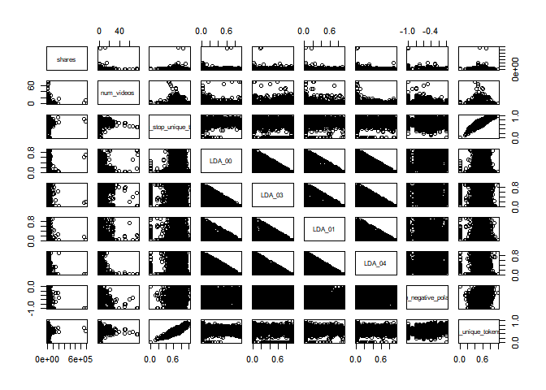

Project 2
================
Jackie Steffan
10/16/2020

``` r
#load in required packages
library(tidyverse)
library(corrplot)
library(ggplot2)
library(GGally)
library(tree)
library(caret)
library(gbm)
library(rpart)
library(rmarkdown)
library(knitr)
```

# Introduction

This data set looks at articles that were published on the website
Mashable. The articles included were published over a 2 year period. The
goal of the data set was to look at the frequency of sharing and the
popularity of each article. According to the data documentation, the
variables url and timedelta are non-predicitve, so I chose not to use
them.  
This analysis is intended to predict the number of shares an article
will have based on other factors such as word count, number of pictures,
etc. I am using 2 tree methods that you will see later in this document.
One is a non-ensemble regression tree and the other is a bosoted tree.

# Data

In this section I am reading in the data described above.  
I then separate the data into a training data set that contains 70% of
the data and a testing data set that contains the remaining 30% of the
data.

``` r
#read in data
popData <- read_csv("./OnlineNewsPopularity.csv")
```

    ## Parsed with column specification:
    ## cols(
    ##   .default = col_double(),
    ##   url = col_character()
    ## )

    ## See spec(...) for full column specifications.

``` r
#combine boolean varaibles to make them easier to work with using mutate
popData <- popData %>% mutate(weekday = ifelse(weekday_is_monday == 1, "Monday", 
                                    ifelse(weekday_is_tuesday == 1, "Tuesday",
                                           ifelse(weekday_is_wednesday==1, "Wednesday",
                                                  ifelse(weekday_is_thursday==1, "Thursday",
                                                         ifelse(weekday_is_friday==1, "Friday",
                                                                ifelse(weekday_is_saturday==1, "Saturday", "Sunday"))))))) %>%
  mutate(channel_type = ifelse(data_channel_is_lifestyle == 1, "Lifestyle",
                               ifelse(data_channel_is_entertainment ==1, "Entertainment",
                                      ifelse(data_channel_is_bus ==1, "Business",
                                             ifelse(data_channel_is_socmed ==1, "Social Media",
                                                    ifelse(data_channel_is_tech == 1, "Tech",
                                                           ifelse(data_channel_is_world ==1, "World", "Other"))))))) %>%
                                    select(-starts_with("weekday_is"), -starts_with("data_channel"))

#filter to select appropriate weekday
weekdayDat <- filter(popData, weekday == params$weekday)

#set seed for reproducibility
set.seed(5)
#split into training and test sets
train <- sample(1:nrow(weekdayDat), size = nrow(weekdayDat)*0.7)
test <- dplyr::setdiff(1:nrow(weekdayDat), train)
DayTrain <- weekdayDat[train, ]
DayTest <- weekdayDat[test, ]
```

# Summarization

Here I am creating summaries for all the predictive variables that are
numeric, the summaries included are min, max, median, mean, and the
first and 3rd quantiles. I am also including a correlation plot that
shows the correlation between our response variable, shares, and the
other predictive numeric variables. Lastly I included a pairs plot of
the response variable and some other predictive variables, which shows
what the 2 variables look like plotted against one another.

``` r
#summary of numeric variables
summary(select(DayTrain,-c("url", "weekday", "timedelta", "channel_type", "is_weekend")))
```

    ##  n_tokens_title  n_tokens_content n_unique_tokens  n_non_stop_words n_non_stop_unique_tokens
    ##  Min.   : 2.00   Min.   :   0.0   Min.   :0.0000   Min.   :0.0000   Min.   :0.0000          
    ##  1st Qu.: 9.00   1st Qu.: 246.0   1st Qu.:0.4747   1st Qu.:1.0000   1st Qu.:0.6302          
    ##  Median :10.00   Median : 392.0   Median :0.5448   Median :1.0000   Median :0.6935          
    ##  Mean   :10.44   Mean   : 539.8   Mean   :0.5330   Mean   :0.9723   Mean   :0.6755          
    ##  3rd Qu.:12.00   3rd Qu.: 708.0   3rd Qu.:0.6100   3rd Qu.:1.0000   3rd Qu.:0.7562          
    ##  Max.   :18.00   Max.   :7764.0   Max.   :1.0000   Max.   :1.0000   Max.   :1.0000          
    ##    num_hrefs     num_self_hrefs      num_imgs       num_videos     average_token_length  num_keywords   
    ##  Min.   :  0.0   Min.   : 0.000   Min.   : 0.00   Min.   : 0.000   Min.   :0.000        Min.   : 2.000  
    ##  1st Qu.:  4.0   1st Qu.: 1.000   1st Qu.: 1.00   1st Qu.: 0.000   1st Qu.:4.479        1st Qu.: 6.000  
    ##  Median :  7.0   Median : 3.000   Median : 1.00   Median : 0.000   Median :4.654        Median : 7.000  
    ##  Mean   : 10.7   Mean   : 3.412   Mean   : 4.44   Mean   : 1.345   Mean   :4.550        Mean   : 7.149  
    ##  3rd Qu.: 13.0   3rd Qu.: 4.000   3rd Qu.: 3.00   3rd Qu.: 1.000   3rd Qu.:4.840        3rd Qu.: 9.000  
    ##  Max.   :162.0   Max.   :44.000   Max.   :93.00   Max.   :75.000   Max.   :8.042        Max.   :10.000  
    ##    kw_min_min       kw_max_min      kw_avg_min        kw_min_max       kw_max_max       kw_avg_max    
    ##  Min.   : -1.00   Min.   :    0   Min.   :   -1.0   Min.   :     0   Min.   :     0   Min.   :     0  
    ##  1st Qu.: -1.00   1st Qu.:  438   1st Qu.:  134.2   1st Qu.:     0   1st Qu.:843300   1st Qu.:174763  
    ##  Median : -1.00   Median :  646   Median :  230.8   Median :  1300   Median :843300   Median :244906  
    ##  Mean   : 26.88   Mean   : 1152   Mean   :  309.2   Mean   : 11484   Mean   :748600   Mean   :258805  
    ##  3rd Qu.:  4.00   3rd Qu.: 1000   3rd Qu.:  355.0   3rd Qu.:  7200   3rd Qu.:843300   3rd Qu.:331981  
    ##  Max.   :318.00   Max.   :98700   Max.   :14187.8   Max.   :690400   Max.   :843300   Max.   :798220  
    ##    kw_min_avg       kw_max_avg       kw_avg_avg    self_reference_min_shares self_reference_max_shares
    ##  Min.   :  -1.0   Min.   :     0   Min.   :    0   Min.   :     0.0          Min.   :     0           
    ##  1st Qu.:   0.0   1st Qu.:  3534   1st Qu.: 2360   1st Qu.:   666.2          1st Qu.:  1100           
    ##  Median : 978.6   Median :  4280   Median : 2842   Median :  1200.0          Median :  2900           
    ##  Mean   :1078.1   Mean   :  5446   Mean   : 3061   Mean   :  3741.3          Mean   :  9846           
    ##  3rd Qu.:1979.6   3rd Qu.:  5947   3rd Qu.: 3539   3rd Qu.:  2600.0          3rd Qu.:  8000           
    ##  Max.   :3602.1   Max.   :121943   Max.   :18807   Max.   :298400.0          Max.   :843300           
    ##  self_reference_avg_sharess     LDA_00            LDA_01            LDA_02            LDA_03       
    ##  Min.   :     0             Min.   :0.01818   Min.   :0.01819   Min.   :0.01819   Min.   :0.01820  
    ##  1st Qu.:  1027             1st Qu.:0.02517   1st Qu.:0.02505   1st Qu.:0.02857   1st Qu.:0.02857  
    ##  Median :  2160             Median :0.03343   Median :0.03337   Median :0.04000   Median :0.04000  
    ##  Mean   :  6144             Mean   :0.18866   Mean   :0.15323   Mean   :0.20470   Mean   :0.21894  
    ##  3rd Qu.:  5200             3rd Qu.:0.25541   3rd Qu.:0.17294   3rd Qu.:0.31428   3rd Qu.:0.34834  
    ##  Max.   :346950             Max.   :0.91999   Max.   :0.91997   Max.   :0.92000   Max.   :0.92653  
    ##      LDA_04        global_subjectivity global_sentiment_polarity global_rate_positive_words
    ##  Min.   :0.01818   Min.   :0.0000      Min.   :-0.3802           Min.   :0.00000           
    ##  1st Qu.:0.02857   1st Qu.:0.3945      1st Qu.: 0.0563           1st Qu.:0.02843           
    ##  Median :0.04004   Median :0.4528      Median : 0.1172           Median :0.03846           
    ##  Mean   :0.23447   Mean   :0.4420      Mean   : 0.1165           Mean   :0.03916           
    ##  3rd Qu.:0.41180   3rd Qu.:0.5048      3rd Qu.: 0.1744           3rd Qu.:0.04954           
    ##  Max.   :0.92708   Max.   :1.0000      Max.   : 0.5755           Max.   :0.13636           
    ##  global_rate_negative_words rate_positive_words rate_negative_words avg_positive_polarity
    ##  Min.   :0.000000           Min.   :0.0000      Min.   :0.0000      Min.   :0.0000       
    ##  1st Qu.:0.009786           1st Qu.:0.6000      1st Qu.:0.1897      1st Qu.:0.3064       
    ##  Median :0.015469           Median :0.7080      Median :0.2849      Median :0.3582       
    ##  Mean   :0.016832           Mean   :0.6799      Mean   :0.2924      Mean   :0.3545       
    ##  3rd Qu.:0.021898           3rd Qu.:0.8000      3rd Qu.:0.3889      3rd Qu.:0.4111       
    ##  Max.   :0.092160           Max.   :1.0000      Max.   :1.0000      Max.   :1.0000       
    ##  min_positive_polarity max_positive_polarity avg_negative_polarity min_negative_polarity
    ##  Min.   :0.00000       Min.   :0.0000        Min.   :-1.0000       Min.   :-1.000       
    ##  1st Qu.:0.05000       1st Qu.:0.6000        1st Qu.:-0.3286       1st Qu.:-0.700       
    ##  Median :0.10000       Median :0.8000        Median :-0.2542       Median :-0.500       
    ##  Mean   :0.09646       Mean   :0.7595        Mean   :-0.2592       Mean   :-0.519       
    ##  3rd Qu.:0.10000       3rd Qu.:1.0000        3rd Qu.:-0.1852       3rd Qu.:-0.300       
    ##  Max.   :1.00000       Max.   :1.0000        Max.   : 0.0000       Max.   : 0.000       
    ##  max_negative_polarity title_subjectivity title_sentiment_polarity abs_title_subjectivity
    ##  Min.   :-1.0000       Min.   :0.0000     Min.   :-1.00000         Min.   :0.0000        
    ##  1st Qu.:-0.1250       1st Qu.:0.0000     1st Qu.: 0.00000         1st Qu.:0.1500        
    ##  Median :-0.1000       Median :0.1250     Median : 0.00000         Median :0.5000        
    ##  Mean   :-0.1061       Mean   :0.2757     Mean   : 0.06246         Mean   :0.3414        
    ##  3rd Qu.:-0.0500       3rd Qu.:0.5000     3rd Qu.: 0.13636         3rd Qu.:0.5000        
    ##  Max.   : 0.0000       Max.   :1.0000     Max.   : 1.00000         Max.   :0.5000        
    ##  abs_title_sentiment_polarity     shares        
    ##  Min.   :0.0000               Min.   :    43.0  
    ##  1st Qu.:0.0000               1st Qu.:   918.2  
    ##  Median :0.0000               Median :  1400.0  
    ##  Mean   :0.1488               Mean   :  3713.2  
    ##  3rd Qu.:0.2321               3rd Qu.:  2700.0  
    ##  Max.   :1.0000               Max.   :690400.0

``` r
#correlation of selected variables
cors <- cor(select(DayTrain, -url, -timedelta, -weekday, -channel_type, -is_weekend))
#correlation plot showing just correlation with the response variable shares
corrplot(cors["shares",,drop=FALSE], type = "upper", tl.pos = "lt",cl.pos = "n")
```

<!-- -->

``` r
#pairs data with selected variables
pairs(select(DayTrain, shares, num_hrefs, self_reference_min_shares, kw_max_min, self_reference_avg_sharess, kw_avg_avg, kw_avg_min, average_token_length, global_sentiment_polarity))
```

<!-- -->

``` r
pairs(select(DayTrain, shares,num_videos, n_non_stop_unique_tokens, LDA_00, LDA_03, LDA_01, LDA_04, min_negative_polarity, n_unique_tokens))
```

<!-- -->

# Models

In this section I am creating 2 tree models. The first is a non-ensemble
based tree selected using leave one out cross-validation. I am also
using cp between 0 and 0.2 for my tuning parameter. The final model is
printed below.  
The second model is a boosted tree selected using repeated cross
validation and the default tuning parameters. The final model is also
printed in the output.  
Lastly, you will find a comparison of RMSE, when deciding which model is
the “better” model you should select the one that has the lower RMSE.

``` r
#select relevant datapoints
treeDat <- select(DayTrain,-c("url", "weekday", "is_weekend", "timedelta"))
#build regression tree using rpart and train using LOOCV and tuning parameter cp
classTree <- train(shares~., data= select(DayTrain,-url, -weekday, -is_weekend, -timedelta), 
                   method= "rpart",
                   trControl = trainControl(method = "LOOCV"),
                   tuneGrid = data.frame(cp=0:0.2),
                   metric = "MAE")
#print results of tree
classTree$results
```

    ##   cp     RMSE    Rsquared      MAE
    ## 1  0 16989.47 0.002179308 4054.387

``` r
#predict the number of shares on the test dataset using the above tree
pred<- predict(classTree, newdata = select(DayTest, -c("url", starts_with("weekday_is"), "is_weekend")))
#calculate RMSE
trRMSE<- sqrt(mean((pred-DayTest$shares)^2))


#boosted model
#build boosted tree using gbm and train with repeated cross validation and default tuning parameters.
gbmGrid <-  expand.grid(interaction.depth = c(1, 5, 9), 
                        n.trees = (1:3)*50, 
                        shrinkage = c(0.1, 0.2),
                        n.minobsinnode = c(10,20))
boostTree <- train(shares ~ ., data = treeDat, method = "gbm",
                   trControl = trainControl(method = "repeatedcv", number = 10, repeats = 5),
                   preProcess = c("center", "scale"), verbose = FALSE,
                   tuneGrid = gbmGrid)
#print results of boosted tree
boostTree$results
```

    ##    shrinkage interaction.depth n.minobsinnode n.trees     RMSE    Rsquared      MAE   RMSESD  RsquaredSD
    ## 1        0.1                 1             10      50 13369.39 0.005696145 3853.144 9752.581 0.009394539
    ## 4        0.1                 1             20      50 13165.05 0.008182736 3820.518 9825.335 0.010637018
    ## 19       0.2                 1             10      50 13469.80 0.005423728 3871.796 9749.515 0.008159936
    ## 22       0.2                 1             20      50 13257.24 0.008569626 3842.452 9761.440 0.009983708
    ## 7        0.1                 5             10      50 13320.44 0.011973134 3833.676 9739.189 0.011551901
    ## 10       0.1                 5             20      50 13183.04 0.015799287 3824.027 9797.758 0.014638905
    ## 25       0.2                 5             10      50 13862.47 0.011736170 4071.631 9499.969 0.015636906
    ## 28       0.2                 5             20      50 13633.95 0.012183497 4022.305 9546.545 0.011885532
    ## 13       0.1                 9             10      50 13417.82 0.012285016 3913.016 9697.095 0.010237403
    ## 16       0.1                 9             20      50 13223.51 0.017624229 3877.752 9775.301 0.017005135
    ## 31       0.2                 9             10      50 14026.98 0.010460039 4305.556 9424.541 0.012499525
    ## 34       0.2                 9             20      50 13712.55 0.014676061 4214.226 9560.459 0.020625907
    ## 2        0.1                 1             10     100 13455.85 0.005982414 3863.359 9715.939 0.008101864
    ## 5        0.1                 1             20     100 13249.07 0.008028762 3840.018 9768.434 0.009016119
    ## 20       0.2                 1             10     100 13599.15 0.005561028 3917.632 9687.161 0.008081434
    ## 23       0.2                 1             20     100 13266.54 0.009023053 3851.829 9760.139 0.009325891
    ## 8        0.1                 5             10     100 13659.08 0.009818754 3966.552 9589.609 0.010727381
    ## 11       0.1                 5             20     100 13457.52 0.011657095 3934.549 9686.030 0.009900173
    ## 26       0.2                 5             10     100 14489.90 0.010266923 4326.274 9249.866 0.015574172
    ## 29       0.2                 5             20     100 14103.55 0.008997194 4253.027 9427.050 0.009291816
    ## 14       0.1                 9             10     100 13773.14 0.010708805 4090.207 9547.996 0.010781056
    ## 17       0.1                 9             20     100 13482.18 0.014633262 4038.044 9683.376 0.015147243
    ## 32       0.2                 9             10     100 14653.93 0.006139941 4651.708 9183.953 0.008113186
    ## 35       0.2                 9             20     100 14289.83 0.011260100 4589.151 9326.709 0.017110818
    ## 3        0.1                 1             10     150 13525.05 0.005905631 3885.648 9681.480 0.007801815
    ## 6        0.1                 1             20     150 13257.02 0.008122133 3845.627 9763.455 0.008636529
    ## 21       0.2                 1             10     150 13700.79 0.006296124 3948.000 9668.939 0.009154469
    ## 24       0.2                 1             20     150 13320.08 0.008276650 3870.573 9730.511 0.008123981
    ## 9        0.1                 5             10     150 13910.58 0.007518270 4061.845 9510.549 0.007679380
    ## 12       0.1                 5             20     150 13679.39 0.010079136 4020.792 9620.641 0.008761216
    ## 27       0.2                 5             10     150 14940.85 0.008296194 4529.660 9133.146 0.011820823
    ## 30       0.2                 5             20     150 14405.01 0.007181475 4458.316 9286.213 0.007489221
    ## 15       0.1                 9             10     150 14150.32 0.008762886 4254.718 9402.848 0.009622126
    ## 18       0.1                 9             20     150 13748.15 0.012200300 4197.182 9575.071 0.013996652
    ## 33       0.2                 9             10     150 15113.92 0.005440404 4884.614 9001.729 0.007385341
    ## 36       0.2                 9             20     150 14781.72 0.008577954 4850.397 9177.704 0.013033318
    ##       MAESD
    ## 1  609.3854
    ## 4  600.4883
    ## 19 628.2942
    ## 22 609.0728
    ## 7  629.2146
    ## 10 630.0506
    ## 25 643.4523
    ## 28 617.4812
    ## 13 655.2132
    ## 16 632.3833
    ## 31 656.3146
    ## 34 630.4322
    ## 2  621.2937
    ## 5  611.2086
    ## 20 622.7557
    ## 23 617.6606
    ## 8  618.4974
    ## 11 611.6448
    ## 26 662.2059
    ## 29 618.5075
    ## 14 647.3352
    ## 17 632.1573
    ## 32 638.4130
    ## 35 588.3044
    ## 3  615.9882
    ## 6  606.1722
    ## 21 621.0027
    ## 24 613.2256
    ## 9  623.4821
    ## 12 616.4308
    ## 27 668.4308
    ## 30 632.7140
    ## 15 641.7181
    ## 18 622.8173
    ## 33 651.6735
    ## 36 593.2146

``` r
#print best tree
boostTree$bestTune
```

    ##   n.trees interaction.depth shrinkage n.minobsinnode
    ## 4      50                 1       0.1             20

``` r
#predict number of shares on the test data set using the boosted tree
boostPred <- predict(boostTree, newdata = select(DayTest, -c("url", starts_with("weekday_is"), "is_weekend")), n.trees = 5000)
#calculate RMSE
boostRMSE<- sqrt(mean((boostPred-DayTest$shares)^2))


#print RMSE for both models and compare results.
c(tree = trRMSE, boost = boostRMSE)
```

    ##     tree    boost 
    ## 12236.08 10308.58

# Linear Regression Model

This part of the code was added by Hannah Park as part II of the
project. Here, a linear regression model is fit on the training data set
using the same predictor variables as those used in the two tree models.
Then, predictions of the model are made on the test data set, and the
test MSE from the linear regression model is compared to those of the
tree models.

``` r
# Fit a linear regression
linReg <- train(shares ~ .,
                data = select(DayTrain,-url, -weekday, -is_weekend, -timedelta),
                method = "lm",
                trControl = trainControl(method = "cv", number = 10))
summary(linReg)
```

    ## 
    ## Call:
    ## lm(formula = .outcome ~ ., data = dat)
    ## 
    ## Residuals:
    ##    Min     1Q Median     3Q    Max 
    ## -56570  -2622   -933    739 678870 
    ## 
    ## Coefficients: (2 not defined because of singularities)
    ##                                Estimate Std. Error t value Pr(>|t|)    
    ## (Intercept)                   1.401e+03  3.164e+03   0.443   0.6580    
    ## n_tokens_title                7.317e+01  1.165e+02   0.628   0.5299    
    ## n_tokens_content             -7.616e-01  9.024e-01  -0.844   0.3988    
    ## n_unique_tokens              -5.712e+03  7.637e+03  -0.748   0.4545    
    ## n_non_stop_words              1.486e+02  6.586e+03   0.023   0.9820    
    ## n_non_stop_unique_tokens      6.250e+03  6.458e+03   0.968   0.3332    
    ## num_hrefs                     2.682e+01  2.614e+01   1.026   0.3050    
    ## num_self_hrefs                8.623e+01  7.137e+01   1.208   0.2270    
    ## num_imgs                      3.052e+01  3.741e+01   0.816   0.4147    
    ## num_videos                    1.128e+02  5.505e+01   2.049   0.0405 *  
    ## average_token_length         -1.507e+03  9.613e+02  -1.568   0.1171    
    ## num_keywords                  1.193e+02  1.489e+02   0.801   0.4230    
    ## kw_min_min                   -9.892e+00  5.455e+00  -1.813   0.0699 .  
    ## kw_max_min                   -5.114e-01  2.971e-01  -1.722   0.0852 .  
    ## kw_avg_min                    3.894e+00  1.925e+00   2.023   0.0431 *  
    ## kw_min_max                   -8.201e-03  5.782e-03  -1.418   0.1562    
    ## kw_max_max                   -2.728e-03  1.959e-03  -1.392   0.1639    
    ## kw_avg_max                   -7.804e-04  3.324e-03  -0.235   0.8144    
    ## kw_min_avg                   -1.557e-01  3.066e-01  -0.508   0.6117    
    ## kw_max_avg                   -1.544e-01  1.096e-01  -1.408   0.1591    
    ## kw_avg_avg                    1.417e+00  5.831e-01   2.430   0.0151 *  
    ## self_reference_min_shares     3.862e-01  3.941e-02   9.800   <2e-16 ***
    ## self_reference_max_shares     8.346e-03  2.103e-02   0.397   0.6915    
    ## self_reference_avg_sharess   -2.150e-02  5.225e-02  -0.412   0.6807    
    ## LDA_00                       -2.346e+02  1.809e+03  -0.130   0.8968    
    ## LDA_01                       -9.950e+01  2.006e+03  -0.050   0.9604    
    ## LDA_02                       -8.484e+01  1.840e+03  -0.046   0.9632    
    ## LDA_03                       -1.407e+02  1.927e+03  -0.073   0.9418    
    ## LDA_04                               NA         NA      NA       NA    
    ## global_subjectivity           3.905e+03  3.384e+03   1.154   0.2487    
    ## global_sentiment_polarity    -6.061e+03  6.603e+03  -0.918   0.3587    
    ## global_rate_positive_words    2.532e+03  2.866e+04   0.088   0.9296    
    ## global_rate_negative_words   -1.099e+04  5.299e+04  -0.207   0.8357    
    ## rate_positive_words           3.247e+03  4.277e+03   0.759   0.4478    
    ## rate_negative_words                  NA         NA      NA       NA    
    ## avg_positive_polarity         6.705e+03  5.323e+03   1.260   0.2079    
    ## min_positive_polarity        -8.284e+03  4.532e+03  -1.828   0.0676 .  
    ## max_positive_polarity        -2.107e+03  1.708e+03  -1.234   0.2174    
    ## avg_negative_polarity         7.151e+01  5.000e+03   0.014   0.9886    
    ## min_negative_polarity        -2.059e+03  1.838e+03  -1.120   0.2627    
    ## max_negative_polarity        -3.826e+03  4.203e+03  -0.910   0.3627    
    ## title_subjectivity           -8.487e+02  1.107e+03  -0.767   0.4433    
    ## title_sentiment_polarity      8.971e+01  1.014e+03   0.089   0.9295    
    ## abs_title_subjectivity        4.740e+02  1.469e+03   0.323   0.7469    
    ## abs_title_sentiment_polarity  7.095e+02  1.586e+03   0.447   0.6547    
    ## channel_typeEntertainment    -2.155e+03  1.446e+03  -1.490   0.1362    
    ## channel_typeLifestyle        -2.034e+03  1.508e+03  -1.348   0.1776    
    ## channel_typeOther            -1.022e+03  1.547e+03  -0.661   0.5088    
    ## `channel_typeSocial Media`   -2.759e+03  1.310e+03  -2.106   0.0353 *  
    ## channel_typeTech             -2.208e+03  1.303e+03  -1.695   0.0902 .  
    ## channel_typeWorld            -1.194e+03  1.433e+03  -0.833   0.4046    
    ## ---
    ## Signif. codes:  0 '***' 0.001 '**' 0.01 '*' 0.05 '.' 0.1 ' ' 1
    ## 
    ## Residual standard error: 15630 on 4613 degrees of freedom
    ## Multiple R-squared:  0.0852, Adjusted R-squared:  0.07568 
    ## F-statistic: 8.951 on 48 and 4613 DF,  p-value: < 2.2e-16

``` r
# Make predictions using the Test set
lmPred <- predict(linReg, DayTest)
DayTest$predictions <- lmPred
kable(head(select(DayTest, shares, predictions)))
```

| shares | predictions |
| -----: | ----------: |
|    711 |    364.2269 |
|   1500 |   3840.2384 |
|   1200 |    272.2692 |
|    891 |   1816.1255 |
|    710 |  \-315.4640 |
|   1900 |  \-155.7226 |

``` r
# Compare test RMSE of lm model to those of the two tree models
lmRMSE <- sqrt(mean((lmPred - DayTest$shares)^2))
kable(c("Regression Tree" = trRMSE, 
        "Boosted Tree" = boostRMSE, 
        "Linear Regression" = lmRMSE),
      col.names = "RMSE")
```

|                   |     RMSE |
| ----------------- | -------: |
| Regression Tree   | 12236.08 |
| Boosted Tree      | 10308.58 |
| Linear Regression | 13236.42 |
