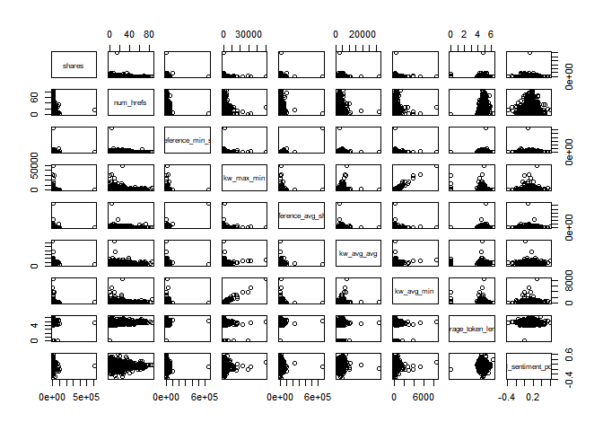

Project 2
================
Jackie Steffan
10/16/2020

``` r
#load in required packages
library(tidyverse)
library(corrplot)
library(ggplot2)
library(GGally)
library(tree)
library(caret)
library(gbm)
library(rpart)
library(rmarkdown)
```

# Introduction

This data set looks at articles that were published on the website
Mashable. The articles included were published over a 2 year period. The
goal of the data set was to look at the frequency of sharing and the
popularity of each article. According to the data documentation, the
variables url and timedelta are non-predicitve, so I chose not to use
them.  
This analysis is intended to predict the number of shares an article
will have based on other factors such as word count, number of pictures,
etc. I am using 2 tree methods that you will see later in this document.
One is a non-ensemble regression tree and the other is a bosoted tree.

# Data

In this section I am reading in the data described above.  
I then separate the data into a training data set that contains 70% of
the data and a testing data set that contains the remaining 30% of the
data.

``` r
#read in data
popData <- read_csv("./OnlineNewsPopularity.csv")
```

    ## Parsed with column specification:
    ## cols(
    ##   .default = col_double(),
    ##   url = col_character()
    ## )

    ## See spec(...) for full column specifications.

``` r
#combine boolean varaibles to make them easier to work with using mutate
popData <- popData %>% mutate(weekday = ifelse(weekday_is_monday == 1, "Monday", 
                                    ifelse(weekday_is_tuesday == 1, "Tuesday",
                                           ifelse(weekday_is_wednesday==1, "Wednesday",
                                                  ifelse(weekday_is_thursday==1, "Thursday",
                                                         ifelse(weekday_is_friday==1, "Friday",
                                                                ifelse(weekday_is_saturday==1, "Saturday", "Sunday"))))))) %>%
  mutate(channel_type = ifelse(data_channel_is_lifestyle == 1, "Lifestyle",
                               ifelse(data_channel_is_entertainment ==1, "Entertainment",
                                      ifelse(data_channel_is_bus ==1, "Business",
                                             ifelse(data_channel_is_socmed ==1, "Social Media",
                                                    ifelse(data_channel_is_tech == 1, "Tech",
                                                           ifelse(data_channel_is_world ==1, "World", "Other"))))))) %>%
                                    select(-starts_with("weekday_is"), -starts_with("data_channel"))

#filter to select appropriate weekday
weekdayDat <- filter(popData, weekday== params$weekday)

#set seed for reproducibility
set.seed(5)
#split into training and test sets
train <- sample(1:nrow(weekdayDat), size = nrow(weekdayDat)*0.7)
test <- dplyr::setdiff(1:nrow(weekdayDat), train)
DayTrain <- weekdayDat[train, ]
DayTest <- weekdayDat[test, ]
```

# Summarization

Here I am creating summaries for all the predictive variables that are
numeric, the summaries included are min, max, median, mean, and the
first and 3rd quantiles. I am also including a correlation plot that
shows the correlation between our response variable, shares, and the
other predictive numeric variables. Lastly I included a pairs plot of
the response variable and some other predictive variables, which shows
what the 2 variables look like plotted against one another.

``` r
#summary of numeric variables
summary(select(DayTrain,-c("url", "weekday", "timedelta", "channel_type", "is_weekend")))
```

    ##  n_tokens_title  n_tokens_content n_unique_tokens  n_non_stop_words n_non_stop_unique_tokens   num_hrefs    num_self_hrefs     num_imgs     
    ##  Min.   : 5.00   Min.   :   0.0   Min.   :0.0000   Min.   :0.000    Min.   :0.0000           Min.   : 0.0   Min.   : 0.00   Min.   :  0.00  
    ##  1st Qu.: 9.00   1st Qu.: 283.0   1st Qu.:0.4587   1st Qu.:1.000    1st Qu.:0.6126           1st Qu.: 5.0   1st Qu.: 1.00   1st Qu.:  1.00  
    ##  Median :10.00   Median : 509.0   Median :0.5178   Median :1.000    Median :0.6740           Median :10.0   Median : 3.00   Median :  1.00  
    ##  Mean   :10.32   Mean   : 601.5   Mean   :0.5144   Mean   :0.968    Mean   :0.6578           Mean   :13.4   Mean   : 3.96   Mean   :  5.46  
    ##  3rd Qu.:12.00   3rd Qu.: 783.0   3rd Qu.:0.5907   3rd Qu.:1.000    3rd Qu.:0.7354           3rd Qu.:18.0   3rd Qu.: 5.00   3rd Qu.:  9.00  
    ##  Max.   :18.00   Max.   :7034.0   Max.   :0.9574   Max.   :1.000    Max.   :1.0000           Max.   :86.0   Max.   :74.00   Max.   :100.00  
    ##    num_videos     average_token_length  num_keywords      kw_min_min       kw_max_min      kw_avg_min       kw_min_max       kw_max_max    
    ##  Min.   : 0.000   Min.   :0.000        Min.   : 1.000   Min.   : -1.00   Min.   :    0   Min.   :  -1.0   Min.   :     0   Min.   : 37400  
    ##  1st Qu.: 0.000   1st Qu.:4.487        1st Qu.: 6.000   1st Qu.: -1.00   1st Qu.:  471   1st Qu.: 146.0   1st Qu.:     0   1st Qu.:843300  
    ##  Median : 0.000   Median :4.667        Median : 8.000   Median : -1.00   Median :  712   Median : 251.0   Median :  1900   Median :843300  
    ##  Mean   : 1.151   Mean   :4.540        Mean   : 7.603   Mean   : 22.82   Mean   : 1081   Mean   : 302.3   Mean   : 13943   Mean   :765137  
    ##  3rd Qu.: 1.000   3rd Qu.:4.855        3rd Qu.: 9.000   3rd Qu.:  4.00   3rd Qu.: 1100   3rd Qu.: 367.6   3rd Qu.: 10300   3rd Qu.:843300  
    ##  Max.   :74.000   Max.   :6.295        Max.   :10.000   Max.   :217.00   Max.   :50000   Max.   :8540.8   Max.   :843300   Max.   :843300  
    ##    kw_avg_max       kw_min_avg     kw_max_avg       kw_avg_avg    self_reference_min_shares self_reference_max_shares self_reference_avg_sharess
    ##  Min.   :  7178   Min.   :   0   Min.   :  2414   Min.   : 1115   Min.   :     0            Min.   :     0            Min.   :     0            
    ##  1st Qu.:170760   1st Qu.:   0   1st Qu.:  3578   1st Qu.: 2516   1st Qu.:   697            1st Qu.:  1100            1st Qu.:  1033            
    ##  Median :239400   Median :1262   Median :  4737   Median : 3032   Median :  1300            Median :  2900            Median :  2375            
    ##  Mean   :251122   Mean   :1267   Mean   :  5946   Mean   : 3285   Mean   :  3683            Mean   : 10302            Mean   :  5782            
    ##  3rd Qu.:316086   3rd Qu.:2207   3rd Qu.:  6727   3rd Qu.: 3841   3rd Qu.:  2700            3rd Qu.:  8300            3rd Qu.:  5350            
    ##  Max.   :843300   Max.   :3594   Max.   :164725   Max.   :32524   Max.   :663600            Max.   :690400            Max.   :663600            
    ##      LDA_00            LDA_01            LDA_02            LDA_03            LDA_04        global_subjectivity global_sentiment_polarity
    ##  Min.   :0.01843   Min.   :0.01819   Min.   :0.01826   Min.   :0.01821   Min.   :0.01820   Min.   :0.0000      Min.   :-0.39375         
    ##  1st Qu.:0.02500   1st Qu.:0.02308   1st Qu.:0.02500   1st Qu.:0.02501   1st Qu.:0.02857   1st Qu.:0.4092      1st Qu.: 0.06476         
    ##  Median :0.03333   Median :0.03333   Median :0.04000   Median :0.04000   Median :0.05001   Median :0.4653      Median : 0.12759         
    ##  Mean   :0.16364   Mean   :0.13689   Mean   :0.21805   Mean   :0.22170   Mean   :0.25973   Mean   :0.4523      Mean   : 0.12671         
    ##  3rd Qu.:0.17368   3rd Qu.:0.14050   3rd Qu.:0.35419   3rd Qu.:0.36709   3rd Qu.:0.46614   3rd Qu.:0.5179      3rd Qu.: 0.19259         
    ##  Max.   :0.91998   Max.   :0.91996   Max.   :0.92000   Max.   :0.91997   Max.   :0.91999   Max.   :0.8125      Max.   : 0.60000         
    ##  global_rate_positive_words global_rate_negative_words rate_positive_words rate_negative_words avg_positive_polarity min_positive_polarity
    ##  Min.   :0.00000            Min.   :0.00000            Min.   :0.0000      Min.   :0.0000      Min.   :0.0000        Min.   :0.00000      
    ##  1st Qu.:0.02941            1st Qu.:0.01017            1st Qu.:0.6047      1st Qu.:0.1837      1st Qu.:0.3156        1st Qu.:0.05000      
    ##  Median :0.04142            Median :0.01584            Median :0.7143      Median :0.2727      Median :0.3681        Median :0.10000      
    ##  Mean   :0.04153            Mean   :0.01713            Mean   :0.6840      Mean   :0.2839      Mean   :0.3601        Mean   :0.09037      
    ##  3rd Qu.:0.05363            3rd Qu.:0.02236            3rd Qu.:0.8030      3rd Qu.:0.3750      3rd Qu.:0.4184        3rd Qu.:0.10000      
    ##  Max.   :0.13065            Max.   :0.18493            Max.   :1.0000      Max.   :1.0000      Max.   :1.0000        Max.   :1.00000      
    ##  max_positive_polarity avg_negative_polarity min_negative_polarity max_negative_polarity title_subjectivity title_sentiment_polarity
    ##  Min.   :0.0000        Min.   :-1.0000       Min.   :-1.0000       Min.   :-1.000        Min.   :0.0000     Min.   :-1.00000        
    ##  1st Qu.:0.6000        1st Qu.:-0.3311       1st Qu.:-0.7500       1st Qu.:-0.125        1st Qu.:0.0000     1st Qu.: 0.00000        
    ##  Median :0.8000        Median :-0.2594       Median :-0.5000       Median :-0.100        Median :0.2000     Median : 0.00000        
    ##  Mean   :0.7845        Mean   :-0.2650       Mean   :-0.5481       Mean   :-0.103        Mean   :0.2892     Mean   : 0.09307        
    ##  3rd Qu.:1.0000        3rd Qu.:-0.2000       3rd Qu.:-0.3750       3rd Qu.:-0.050        3rd Qu.:0.5000     3rd Qu.: 0.20000        
    ##  Max.   :1.0000        Max.   : 0.0000       Max.   : 0.0000       Max.   : 0.000        Max.   :1.0000     Max.   : 1.00000        
    ##  abs_title_subjectivity abs_title_sentiment_polarity     shares      
    ##  Min.   :0.0000         Min.   :0.00000              Min.   :    49  
    ##  1st Qu.:0.1250         1st Qu.:0.00000              1st Qu.:  1300  
    ##  Median :0.4500         Median :0.03333              Median :  2000  
    ##  Mean   :0.3278         Mean   :0.16729              Mean   :  4136  
    ##  3rd Qu.:0.5000         3rd Qu.:0.25000              3rd Qu.:  3500  
    ##  Max.   :0.5000         Max.   :1.00000              Max.   :617900

``` r
#correlation of selected variables
cors <- cor(select(DayTrain, -url, -timedelta, -weekday, -channel_type, -is_weekend))
#correlation plot showing just correlation with the response variable shares
corrplot(cors["shares",,drop=FALSE], type = "upper", tl.pos = "lt",cl.pos = "n")
```

<!-- -->

``` r
#pairs data with selected variables
pairs(select(DayTrain, shares, num_hrefs, self_reference_min_shares, kw_max_min, self_reference_avg_sharess, kw_avg_avg, kw_avg_min, average_token_length, global_sentiment_polarity))
```

<!-- -->

``` r
pairs(select(DayTrain, shares,num_videos, n_non_stop_unique_tokens, LDA_00, LDA_03, LDA_01, LDA_04, min_negative_polarity, n_unique_tokens))
```

<!-- -->

# Models

In this section I am creating 2 tree models. The first is a non-ensemble
based tree selected using leave one out cross-validation. I am also
using cp between 0 and 0.2 for my tuning parameter. The final model is
printed below.  
The second model is a boosted tree selected using repeated cross
validation and the default tuning parameters. The final model is also
printed in the output.  
Lastly, you will find a comparison of RMSE, when deciding which model is
the “better” model you should select the one that has the lower RMSE.

``` r
#select relevant datapoints
treeDat <- select(DayTrain,-c("url", "weekday", "is_weekend", "timedelta"))
#build regression tree using rpart and train using LOOCV and tuning parameter cp
classTree <- train(shares~., data= select(DayTrain,-url, -weekday, -is_weekend, -timedelta), 
                   method= "rpart",
                   trControl = trainControl(method = "LOOCV"),
                   tuneGrid = data.frame(cp=0:0.2),
                   metric = "MAE")
#print results of tree
classTree$results
```

    ##   cp     RMSE    Rsquared      MAE
    ## 1  0 17182.09 0.004608699 4047.628

``` r
#predict the number of shares on the test dataset using the above tree
pred<- predict(classTree, newdata = select(DayTest, -c("url", starts_with("weekday_is"), "is_weekend")))
#calculate RMSE
trRMSE<- sqrt(mean((pred-DayTest$shares)^2))


#boosted model
#build boosted tree using gbm and train with repeated cross validation and default tuning parameters.
gbmGrid <-  expand.grid(interaction.depth = c(1, 5, 9), 
                        n.trees = (1:3)*50, 
                        shrinkage = c(0.1, 0.2),
                        n.minobsinnode = c(10,20))
boostTree <- train(shares ~ ., data = treeDat, method = "gbm",
                   trControl = trainControl(method = "repeatedcv", number = 10, repeats = 5),
                   preProcess = c("center", "scale"), verbose = FALSE,
                   tuneGrid = gbmGrid)
#print results of boosted tree
boostTree$results
```

    ##    shrinkage interaction.depth n.minobsinnode n.trees     RMSE    Rsquared      MAE   RMSESD  RsquaredSD    MAESD
    ## 1        0.1                 1             10      50 10901.61 0.015285906 3764.032 12366.57 0.018089217 994.0316
    ## 4        0.1                 1             20      50 10874.05 0.015630910 3744.794 12380.85 0.017679743 990.2111
    ## 19       0.2                 1             10      50 11081.42 0.013872863 3975.545 12294.17 0.018296134 944.7446
    ## 22       0.2                 1             20      50 11042.93 0.013647362 3932.688 12299.80 0.015970693 963.6113
    ## 7        0.1                 5             10      50 11814.58 0.007069550 4217.827 12004.00 0.010613249 915.1241
    ## 10       0.1                 5             20      50 11245.21 0.014526967 3931.629 12204.10 0.013940553 969.2915
    ## 25       0.2                 5             10      50 12708.33 0.007201573 4940.337 11653.96 0.008680851 813.6115
    ## 28       0.2                 5             20      50 12014.40 0.007883613 4580.101 11923.63 0.012439947 899.8066
    ## 13       0.1                 9             10      50 11660.26 0.008785656 4229.345 12088.15 0.013131351 975.5635
    ## 16       0.1                 9             20      50 11301.27 0.013190434 4006.952 12178.82 0.018176773 966.8391
    ## 31       0.2                 9             10      50 12633.49 0.008321181 5010.821 11773.36 0.015537279 852.1076
    ## 34       0.2                 9             20      50 12098.35 0.011735613 4717.098 11862.52 0.016532148 881.5788
    ## 2        0.1                 1             10     100 11058.72 0.013417948 3944.651 12303.83 0.016641301 944.9388
    ## 5        0.1                 1             20     100 11025.16 0.013647376 3926.154 12309.88 0.016128509 945.9754
    ## 20       0.2                 1             10     100 11180.77 0.013910141 4104.664 12244.92 0.018170141 928.5091
    ## 23       0.2                 1             20     100 11165.48 0.012981473 4106.422 12241.30 0.016329353 943.4476
    ## 8        0.1                 5             10     100 12399.32 0.007443726 4682.373 11765.90 0.009663793 854.2832
    ## 11       0.1                 5             20     100 11678.37 0.010808078 4295.653 12027.09 0.014741010 922.2768
    ## 26       0.2                 5             10     100 13620.12 0.005806773 5646.717 11375.67 0.008347162 741.0540
    ## 29       0.2                 5             20     100 12687.77 0.009344489 5098.467 11664.21 0.017472429 865.1885
    ## 14       0.1                 9             10     100 12365.70 0.007169494 4763.911 11836.21 0.014028402 904.9950
    ## 17       0.1                 9             20     100 11783.92 0.011167451 4417.228 11985.78 0.018289125 889.3973
    ## 32       0.2                 9             10     100 13479.27 0.009195979 5665.158 11451.26 0.014357936 758.0385
    ## 35       0.2                 9             20     100 12844.17 0.011457216 5336.926 11588.29 0.014544187 820.9765
    ## 3        0.1                 1             10     150 11127.01 0.013099682 4043.120 12272.71 0.016356975 928.4747
    ## 6        0.1                 1             20     150 11111.41 0.013046738 4033.476 12273.72 0.016759423 921.1941
    ## 21       0.2                 1             10     150 11261.46 0.013398510 4177.624 12208.83 0.017554145 905.7541
    ## 24       0.2                 1             20     150 11223.83 0.012617431 4139.922 12210.56 0.016068525 946.2814
    ## 9        0.1                 5             10     150 12828.18 0.007470929 5012.980 11616.76 0.012030246 793.6844
    ## 12       0.1                 5             20     150 12060.17 0.008370748 4565.692 11894.29 0.010322815 884.6212
    ## 27       0.2                 5             10     150 14154.93 0.005767749 6045.772 11203.96 0.008735174 690.3896
    ## 30       0.2                 5             20     150 13307.86 0.008072256 5544.849 11450.40 0.012849390 777.9435
    ## 15       0.1                 9             10     150 12835.07 0.007465500 5076.980 11678.14 0.015124795 847.9178
    ## 18       0.1                 9             20     150 12149.65 0.011070568 4686.983 11856.52 0.018917158 857.6040
    ## 33       0.2                 9             10     150 13955.09 0.008073746 6007.356 11304.05 0.014547156 748.2203
    ## 36       0.2                 9             20     150 13359.21 0.010892303 5711.840 11390.80 0.011917879 748.9072

``` r
#print best tree
boostTree$bestTune
```

    ##   n.trees interaction.depth shrinkage n.minobsinnode
    ## 4      50                 1       0.1             20

``` r
#predict number of shares on the test data set using the boosted tree
boostPred <- predict(boostTree, newdata = select(DayTest, -c("url", starts_with("weekday_is"), "is_weekend")), n.trees = 5000)
#calculate RMSE
boostRMSE<- sqrt(mean((boostPred-DayTest$shares)^2))


#print RMSE for both models and compare results.
c(tree = trRMSE, boost = boostRMSE)
```

    ##     tree    boost 
    ## 9420.591 7355.064
