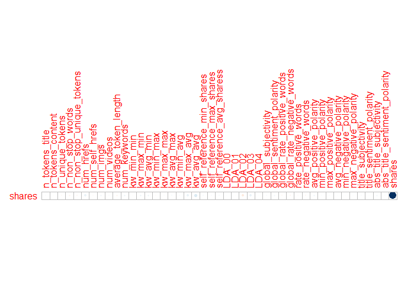
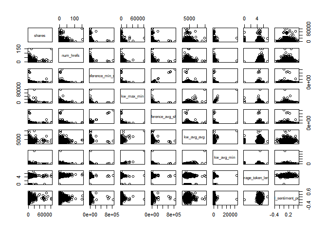
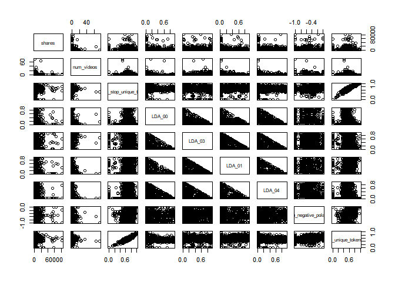

Project 2
================
Jackie Steffan
10/16/2020

``` r
#load in required packages
library(tidyverse)
library(corrplot)
library(ggplot2)
library(GGally)
library(tree)
library(caret)
library(gbm)
library(rpart)
library(rmarkdown)
library(knitr)
```

# Introduction

This data set looks at articles that were published on the website
Mashable. The articles included were published over a 2 year period. The
goal of the data set was to look at the frequency of sharing and the
popularity of each article. According to the data documentation, the
variables url and timedelta are non-predicitve, so I chose not to use
them.  
This analysis is intended to predict the number of shares an article
will have based on other factors such as word count, number of pictures,
etc. I am using 2 tree methods that you will see later in this document.
One is a non-ensemble regression tree and the other is a bosoted tree.

# Data

In this section I am reading in the data described above.  
I then separate the data into a training data set that contains 70% of
the data and a testing data set that contains the remaining 30% of the
data.

``` r
#read in data
popData <- read_csv("./OnlineNewsPopularity.csv")
```

    ## Parsed with column specification:
    ## cols(
    ##   .default = col_double(),
    ##   url = col_character()
    ## )

    ## See spec(...) for full column specifications.

``` r
#combine boolean varaibles to make them easier to work with using mutate
popData <- popData %>% mutate(weekday = ifelse(weekday_is_monday == 1, "Monday", 
                                    ifelse(weekday_is_tuesday == 1, "Tuesday",
                                           ifelse(weekday_is_wednesday==1, "Wednesday",
                                                  ifelse(weekday_is_thursday==1, "Thursday",
                                                         ifelse(weekday_is_friday==1, "Friday",
                                                                ifelse(weekday_is_saturday==1, "Saturday", "Sunday"))))))) %>%
  mutate(channel_type = ifelse(data_channel_is_lifestyle == 1, "Lifestyle",
                               ifelse(data_channel_is_entertainment ==1, "Entertainment",
                                      ifelse(data_channel_is_bus ==1, "Business",
                                             ifelse(data_channel_is_socmed ==1, "Social Media",
                                                    ifelse(data_channel_is_tech == 1, "Tech",
                                                           ifelse(data_channel_is_world ==1, "World", "Other"))))))) %>%
                                    select(-starts_with("weekday_is"), -starts_with("data_channel"))

#filter to select appropriate weekday
weekdayDat <- filter(popData, weekday == params$weekday)

#set seed for reproducibility
set.seed(5)
#split into training and test sets
train <- sample(1:nrow(weekdayDat), size = nrow(weekdayDat)*0.7)
test <- dplyr::setdiff(1:nrow(weekdayDat), train)
DayTrain <- weekdayDat[train, ]
DayTest <- weekdayDat[test, ]
```

# Summarization

Here I am creating summaries for all the predictive variables that are
numeric, the summaries included are min, max, median, mean, and the
first and 3rd quantiles. I am also including a correlation plot that
shows the correlation between our response variable, shares, and the
other predictive numeric variables. Lastly I included a pairs plot of
the response variable and some other predictive variables, which shows
what the 2 variables look like plotted against one another.

``` r
#summary of numeric variables
summary(select(DayTrain,-c("url", "weekday", "timedelta", "channel_type", "is_weekend")))
```

    ##  n_tokens_title  n_tokens_content n_unique_tokens  n_non_stop_words n_non_stop_unique_tokens
    ##  Min.   : 5.00   Min.   :   0.0   Min.   :0.0000   Min.   :0.0000   Min.   :0.0000          
    ##  1st Qu.: 9.00   1st Qu.: 244.0   1st Qu.:0.4612   1st Qu.:1.0000   1st Qu.:0.6158          
    ##  Median :10.00   Median : 461.0   Median :0.5280   Median :1.0000   Median :0.6803          
    ##  Mean   :10.51   Mean   : 610.8   Mean   :0.5286   Mean   :0.9728   Mean   :0.6671          
    ##  3rd Qu.:12.00   3rd Qu.: 822.5   3rd Qu.:0.6087   3rd Qu.:1.0000   3rd Qu.:0.7534          
    ##  Max.   :19.00   Max.   :8474.0   Max.   :1.0000   Max.   :1.0000   Max.   :1.0000          
    ##    num_hrefs      num_self_hrefs      num_imgs         num_videos     average_token_length  num_keywords  
    ##  Min.   :  0.00   Min.   : 0.000   Min.   :  0.000   Min.   : 0.000   Min.   :0.000        Min.   : 1.00  
    ##  1st Qu.:  5.00   1st Qu.: 1.000   1st Qu.:  1.000   1st Qu.: 0.000   1st Qu.:4.487        1st Qu.: 6.00  
    ##  Median :  9.00   Median : 2.000   Median :  1.000   Median : 0.000   Median :4.689        Median : 8.00  
    ##  Mean   : 12.61   Mean   : 3.544   Mean   :  5.805   Mean   : 1.003   Mean   :4.589        Mean   : 7.65  
    ##  3rd Qu.: 17.00   3rd Qu.: 4.000   3rd Qu.:  8.000   3rd Qu.: 1.000   3rd Qu.:4.890        3rd Qu.:10.00  
    ##  Max.   :152.00   Max.   :40.000   Max.   :128.000   Max.   :74.000   Max.   :7.218        Max.   :10.00  
    ##    kw_min_min       kw_max_min      kw_avg_min        kw_min_max       kw_max_max       kw_avg_max    
    ##  Min.   : -1.00   Min.   :    0   Min.   :   -1.0   Min.   :     0   Min.   : 37400   Min.   :  7328  
    ##  1st Qu.: -1.00   1st Qu.:  473   1st Qu.:  157.4   1st Qu.:     0   1st Qu.:843300   1st Qu.:171983  
    ##  Median : -1.00   Median :  680   Median :  237.7   Median :  1900   Median :843300   Median :232358  
    ##  Mean   : 26.52   Mean   : 1130   Mean   :  318.3   Mean   : 13246   Mean   :758191   Mean   :245876  
    ##  3rd Qu.:  4.00   3rd Qu.: 1100   3rd Qu.:  365.4   3rd Qu.:  8900   3rd Qu.:843300   3rd Qu.:310683  
    ##  Max.   :217.00   Max.   :81200   Max.   :27123.0   Max.   :843300   Max.   :843300   Max.   :843300  
    ##    kw_min_avg     kw_max_avg       kw_avg_avg      self_reference_min_shares self_reference_max_shares
    ##  Min.   :   0   Min.   :  2536   Min.   :  743.5   Min.   :     0            Min.   :     0           
    ##  1st Qu.:   0   1st Qu.:  3609   1st Qu.: 2469.9   1st Qu.:   631            1st Qu.:  1000           
    ##  Median :1200   Median :  4768   Median : 3040.8   Median :  1200            Median :  2700           
    ##  Mean   :1230   Mean   :  5966   Mean   : 3277.0   Mean   :  4988            Mean   : 10859           
    ##  3rd Qu.:2159   3rd Qu.:  6825   3rd Qu.: 3818.8   3rd Qu.:  2700            3rd Qu.:  7600           
    ##  Max.   :3585   Max.   :120100   Max.   :15336.1   Max.   :843300            Max.   :843300           
    ##  self_reference_avg_sharess     LDA_00            LDA_01            LDA_02            LDA_03       
    ##  Min.   :     0.0           Min.   :0.01887   Min.   :0.01820   Min.   :0.01819   Min.   :0.01830  
    ##  1st Qu.:   976.8           1st Qu.:0.02340   1st Qu.:0.02500   1st Qu.:0.02500   1st Qu.:0.02562  
    ##  Median :  2147.3           Median :0.03333   Median :0.03335   Median :0.03335   Median :0.05000  
    ##  Mean   :  7000.6           Mean   :0.16404   Mean   :0.16556   Mean   :0.20234   Mean   :0.25818  
    ##  3rd Qu.:  4907.5           3rd Qu.:0.18915   3rd Qu.:0.19478   3rd Qu.:0.29908   3rd Qu.:0.49532  
    ##  Max.   :843300.0           Max.   :0.91996   Max.   :0.91994   Max.   :0.92000   Max.   :0.91998  
    ##      LDA_04        global_subjectivity global_sentiment_polarity global_rate_positive_words
    ##  Min.   :0.02000   Min.   :0.0000      Min.   :-0.37393          Min.   :0.00000           
    ##  1st Qu.:0.02518   1st Qu.:0.3991      1st Qu.: 0.05696          1st Qu.:0.02792           
    ##  Median :0.04000   Median :0.4598      Median : 0.12213          Median :0.03993           
    ##  Mean   :0.20988   Mean   :0.4498      Mean   : 0.12365          Mean   :0.04138           
    ##  3rd Qu.:0.32290   3rd Qu.:0.5158      3rd Qu.: 0.18800          3rd Qu.:0.05344           
    ##  Max.   :0.92644   Max.   :0.9125      Max.   : 0.60877          Max.   :0.15217           
    ##  global_rate_negative_words rate_positive_words rate_negative_words avg_positive_polarity
    ##  Min.   :0.00000            Min.   :0.0000      Min.   :0.0000      Min.   :0.0000       
    ##  1st Qu.:0.01009            1st Qu.:0.6000      1st Qu.:0.1818      1st Qu.:0.3075       
    ##  Median :0.01587            Median :0.7059      Median :0.2857      Median :0.3647       
    ##  Mean   :0.01700            Mean   :0.6811      Mean   :0.2918      Mean   :0.3622       
    ##  3rd Qu.:0.02244            3rd Qu.:0.8041      3rd Qu.:0.3871      3rd Qu.:0.4221       
    ##  Max.   :0.10112            Max.   :1.0000      Max.   :1.0000      Max.   :1.0000       
    ##  min_positive_polarity max_positive_polarity avg_negative_polarity min_negative_polarity
    ##  Min.   :0.00000       Min.   :0.0000        Min.   :-1.0000       Min.   :-1.0000      
    ##  1st Qu.:0.05000       1st Qu.:0.6000        1st Qu.:-0.3352       1st Qu.:-0.7500      
    ##  Median :0.10000       Median :0.8000        Median :-0.2642       Median :-0.5000      
    ##  Mean   :0.09748       Mean   :0.7774        Mean   :-0.2694       Mean   :-0.5472      
    ##  3rd Qu.:0.10000       3rd Qu.:1.0000        3rd Qu.:-0.2000       3rd Qu.:-0.3944      
    ##  Max.   :1.00000       Max.   :1.0000        Max.   : 0.0000       Max.   : 0.0000      
    ##  max_negative_polarity title_subjectivity title_sentiment_polarity abs_title_subjectivity
    ##  Min.   :-1.0000       Min.   :0.0000     Min.   :-1.00000         Min.   :0.0000        
    ##  1st Qu.:-0.1250       1st Qu.:0.0000     1st Qu.: 0.00000         1st Qu.:0.1250        
    ##  Median :-0.1000       Median :0.2708     Median : 0.00000         Median :0.4000        
    ##  Mean   :-0.1095       Mean   :0.3139     Mean   : 0.09534         Mean   :0.3197        
    ##  3rd Qu.:-0.0500       3rd Qu.:0.5000     3rd Qu.: 0.25000         3rd Qu.:0.5000        
    ##  Max.   : 0.0000       Max.   :1.0000     Max.   : 1.00000         Max.   :0.5000        
    ##  abs_title_sentiment_polarity     shares     
    ##  Min.   :0.0000               Min.   :   89  
    ##  1st Qu.:0.0000               1st Qu.: 1200  
    ##  Median :0.1000               Median : 1900  
    ##  Mean   :0.1879               Mean   : 3808  
    ##  3rd Qu.:0.3000               3rd Qu.: 3700  
    ##  Max.   :1.0000               Max.   :83300

``` r
#correlation of selected variables
cors <- cor(select(DayTrain, -url, -timedelta, -weekday, -channel_type, -is_weekend))
#correlation plot showing just correlation with the response variable shares
corrplot(cors["shares",,drop=FALSE], type = "upper", tl.pos = "lt",cl.pos = "n")
```

<!-- -->

``` r
#pairs data with selected variables
pairs(select(DayTrain, shares, num_hrefs, self_reference_min_shares, kw_max_min, self_reference_avg_sharess, kw_avg_avg, kw_avg_min, average_token_length, global_sentiment_polarity))
```

<!-- -->

``` r
pairs(select(DayTrain, shares,num_videos, n_non_stop_unique_tokens, LDA_00, LDA_03, LDA_01, LDA_04, min_negative_polarity, n_unique_tokens))
```

<!-- -->

# Models

In this section I am creating 2 tree models. The first is a non-ensemble
based tree selected using leave one out cross-validation. I am also
using cp between 0 and 0.2 for my tuning parameter. The final model is
printed below.  
The second model is a boosted tree selected using repeated cross
validation and the default tuning parameters. The final model is also
printed in the output.  
Lastly, you will find a comparison of RMSE, when deciding which model is
the “better” model you should select the one that has the lower RMSE.

``` r
#select relevant datapoints
treeDat <- select(DayTrain,-c("url", "weekday", "is_weekend", "timedelta"))
#build regression tree using rpart and train using LOOCV and tuning parameter cp
classTree <- train(shares~., data= select(DayTrain,-url, -weekday, -is_weekend, -timedelta), 
                   method= "rpart",
                   trControl = trainControl(method = "LOOCV"),
                   tuneGrid = data.frame(cp=0:0.2),
                   metric = "MAE")
#print results of tree
classTree$results
```

    ##   cp     RMSE    Rsquared      MAE
    ## 1  0 7395.699 0.004033967 3520.731

``` r
#predict the number of shares on the test dataset using the above tree
pred<- predict(classTree, newdata = select(DayTest, -c("url", starts_with("weekday_is"), "is_weekend")))
#calculate RMSE
trRMSE<- sqrt(mean((pred-DayTest$shares)^2))


#boosted model
#build boosted tree using gbm and train with repeated cross validation and default tuning parameters.
gbmGrid <-  expand.grid(interaction.depth = c(1, 5, 9), 
                        n.trees = (1:3)*50, 
                        shrinkage = c(0.1, 0.2),
                        n.minobsinnode = c(10,20))
boostTree <- train(shares ~ ., data = treeDat, method = "gbm",
                   trControl = trainControl(method = "repeatedcv", number = 10, repeats = 5),
                   preProcess = c("center", "scale"), verbose = FALSE,
                   tuneGrid = gbmGrid)
#print results of boosted tree
boostTree$results
```

    ##    shrinkage interaction.depth n.minobsinnode n.trees     RMSE   Rsquared      MAE   RMSESD RsquaredSD
    ## 1        0.1                 1             10      50 6374.905 0.02539641 3090.632 1431.848 0.02907302
    ## 4        0.1                 1             20      50 6355.517 0.02690361 3084.556 1437.377 0.02740765
    ## 19       0.2                 1             10      50 6442.944 0.01982174 3108.019 1418.273 0.02183981
    ## 22       0.2                 1             20      50 6397.990 0.02522237 3086.061 1433.385 0.02480250
    ## 7        0.1                 5             10      50 6490.495 0.02434270 3165.170 1356.164 0.02181388
    ## 10       0.1                 5             20      50 6394.503 0.03200359 3126.802 1432.376 0.02640219
    ## 25       0.2                 5             10      50 6761.676 0.01758598 3426.605 1329.843 0.01649245
    ## 28       0.2                 5             20      50 6612.194 0.02387350 3372.960 1363.831 0.02367491
    ## 13       0.1                 9             10      50 6511.190 0.03024227 3235.167 1346.378 0.02769380
    ## 16       0.1                 9             20      50 6412.086 0.03547279 3158.725 1396.936 0.03032513
    ## 31       0.2                 9             10      50 6847.494 0.02073166 3611.917 1302.757 0.01931115
    ## 34       0.2                 9             20      50 6665.890 0.02592647 3500.490 1359.049 0.02282626
    ## 2        0.1                 1             10     100 6405.328 0.02546964 3087.968 1422.462 0.02864498
    ## 5        0.1                 1             20     100 6386.065 0.02630362 3079.706 1426.182 0.02607265
    ## 20       0.2                 1             10     100 6463.336 0.02235512 3118.888 1424.099 0.02628205
    ## 23       0.2                 1             20     100 6439.766 0.02269289 3114.015 1435.194 0.02258169
    ## 8        0.1                 5             10     100 6597.074 0.02238892 3273.350 1355.846 0.01989635
    ## 11       0.1                 5             20     100 6500.007 0.02873996 3245.045 1415.520 0.02690046
    ## 26       0.2                 5             10     100 6931.363 0.01748903 3662.560 1300.255 0.01880118
    ## 29       0.2                 5             20     100 6782.306 0.02220991 3600.878 1348.995 0.02623349
    ## 14       0.1                 9             10     100 6631.358 0.02765739 3395.671 1314.490 0.02591006
    ## 17       0.1                 9             20     100 6521.204 0.03297348 3334.098 1365.903 0.02803981
    ## 32       0.2                 9             10     100 7009.685 0.02106423 3868.398 1242.871 0.01891977
    ## 35       0.2                 9             20     100 6862.363 0.02387788 3786.706 1308.989 0.02602789
    ## 3        0.1                 1             10     150 6429.925 0.02352529 3093.291 1426.758 0.02427163
    ## 6        0.1                 1             20     150 6406.718 0.02465642 3074.969 1434.868 0.02340406
    ## 21       0.2                 1             10     150 6495.292 0.02069640 3154.338 1413.401 0.02406844
    ## 24       0.2                 1             20     150 6473.333 0.02130984 3148.856 1441.419 0.01997208
    ## 9        0.1                 5             10     150 6666.759 0.02291846 3377.293 1331.759 0.02057845
    ## 12       0.1                 5             20     150 6572.057 0.02710711 3359.919 1389.793 0.02635561
    ## 27       0.2                 5             10     150 7019.842 0.01679430 3790.049 1285.714 0.01683364
    ## 30       0.2                 5             20     150 6881.131 0.02151452 3751.218 1345.580 0.02654124
    ## 15       0.1                 9             10     150 6723.463 0.02463819 3518.228 1309.583 0.02303367
    ## 18       0.1                 9             20     150 6598.643 0.03182522 3454.725 1367.983 0.02630277
    ## 33       0.2                 9             10     150 7092.439 0.02009010 3968.948 1218.706 0.02144736
    ## 36       0.2                 9             20     150 6963.626 0.02316070 3911.406 1279.584 0.02570035
    ##       MAESD
    ## 1  310.6519
    ## 4  315.4555
    ## 19 317.0847
    ## 22 314.8918
    ## 7  316.2162
    ## 10 330.5589
    ## 25 325.2788
    ## 28 309.7114
    ## 13 315.2304
    ## 16 312.0186
    ## 31 320.6766
    ## 34 327.4770
    ## 2  309.6113
    ## 5  316.4628
    ## 20 314.4191
    ## 23 313.9666
    ## 8  318.7541
    ## 11 340.3496
    ## 26 325.5779
    ## 29 327.9703
    ## 14 311.3766
    ## 17 311.1571
    ## 32 313.5206
    ## 35 313.6934
    ## 3  305.2932
    ## 6  309.6117
    ## 21 312.8285
    ## 24 334.6682
    ## 9  309.1964
    ## 12 339.5691
    ## 27 336.8248
    ## 30 351.6899
    ## 15 309.5751
    ## 18 318.7958
    ## 33 315.4634
    ## 36 311.2504

``` r
#print best tree
boostTree$bestTune
```

    ##   n.trees interaction.depth shrinkage n.minobsinnode
    ## 4      50                 1       0.1             20

``` r
#predict number of shares on the test data set using the boosted tree
boostPred <- predict(boostTree, newdata = select(DayTest, -c("url", starts_with("weekday_is"), "is_weekend")), n.trees = 5000)
#calculate RMSE
boostRMSE<- sqrt(mean((boostPred-DayTest$shares)^2))


#print RMSE for both models and compare results.
c(tree = trRMSE, boost = boostRMSE)
```

    ##     tree    boost 
    ## 6716.743 5352.775

# Linear Regression Model

This part of the code was added by Hannah Park as part II of the
project. Here, a linear regression model is fit on the training data set
using the same predictor variables as those used in the two tree models.
Then, predictions of the model are made on the test data set, and the
test MSE from the linear regression model is compared to those of the
tree models.

``` r
# Fit a linear regression
linReg <- train(shares ~ .,
                data = select(DayTrain,-url, -weekday, -is_weekend, -timedelta),
                method = "lm",
                trControl = trainControl(method = "cv", number = 10))
summary(linReg)
```

    ## 
    ## Call:
    ## lm(formula = .outcome ~ ., data = dat)
    ## 
    ## Residuals:
    ##    Min     1Q Median     3Q    Max 
    ##  -8601  -2416  -1118    329  78098 
    ## 
    ## Coefficients: (2 not defined because of singularities)
    ##                                Estimate Std. Error t value Pr(>|t|)    
    ## (Intercept)                  -1.963e+03  2.211e+03  -0.888 0.374852    
    ## n_tokens_title                1.420e+02  7.196e+01   1.973 0.048640 *  
    ## n_tokens_content              4.087e-02  4.391e-01   0.093 0.925854    
    ## n_unique_tokens               2.725e+03  4.499e+03   0.606 0.544850    
    ## n_non_stop_words              9.929e+02  3.972e+03   0.250 0.802637    
    ## n_non_stop_unique_tokens     -6.010e+02  3.988e+03  -0.151 0.880227    
    ## num_hrefs                     5.518e+01  1.551e+01   3.559 0.000382 ***
    ## num_self_hrefs               -7.642e+01  3.783e+01  -2.020 0.043511 *  
    ## num_imgs                      1.367e+01  1.974e+01   0.693 0.488657    
    ## num_videos                    2.258e+01  4.665e+01   0.484 0.628439    
    ## average_token_length         -7.285e+02  5.519e+02  -1.320 0.187042    
    ## num_keywords                  1.489e+02  9.660e+01   1.541 0.123477    
    ## kw_min_min                    2.383e+00  4.097e+00   0.581 0.560975    
    ## kw_max_min                    1.067e-01  1.318e-01   0.810 0.418255    
    ## kw_avg_min                    3.909e-02  5.184e-01   0.075 0.939900    
    ## kw_min_max                   -1.541e-03  3.648e-03  -0.423 0.672682    
    ## kw_max_max                    1.093e-04  1.521e-03   0.072 0.942732    
    ## kw_avg_max                   -8.061e-06  2.323e-03  -0.003 0.997232    
    ## kw_min_avg                   -6.254e-01  1.889e-01  -3.310 0.000950 ***
    ## kw_max_avg                   -2.396e-01  6.128e-02  -3.910 9.57e-05 ***
    ## kw_avg_avg                    1.863e+00  3.576e-01   5.210 2.10e-07 ***
    ## self_reference_min_shares    -4.668e-03  2.970e-02  -0.157 0.875127    
    ## self_reference_max_shares    -5.238e-03  1.155e-02  -0.454 0.650200    
    ## self_reference_avg_sharess    1.321e-02  3.990e-02   0.331 0.740707    
    ## LDA_00                        8.648e+02  1.317e+03   0.657 0.511468    
    ## LDA_01                        8.446e+02  1.255e+03   0.673 0.501048    
    ## LDA_02                       -2.349e+03  1.236e+03  -1.901 0.057416 .  
    ## LDA_03                       -8.674e+00  1.193e+03  -0.007 0.994197    
    ## LDA_04                               NA         NA      NA       NA    
    ## global_subjectivity          -4.928e+02  2.075e+03  -0.238 0.812267    
    ## global_sentiment_polarity     3.745e+03  4.015e+03   0.933 0.351007    
    ## global_rate_positive_words   -2.483e+04  1.598e+04  -1.554 0.120316    
    ## global_rate_negative_words   -2.599e+04  3.319e+04  -0.783 0.433645    
    ## rate_positive_words          -8.815e+02  2.740e+03  -0.322 0.747737    
    ## rate_negative_words                  NA         NA      NA       NA    
    ## avg_positive_polarity         3.984e+03  3.266e+03   1.220 0.222624    
    ## min_positive_polarity        -2.366e+03  2.782e+03  -0.851 0.395098    
    ## max_positive_polarity        -8.711e+02  1.137e+03  -0.766 0.443769    
    ## avg_negative_polarity        -1.516e+03  3.124e+03  -0.485 0.627462    
    ## min_negative_polarity        -1.664e+02  1.126e+03  -0.148 0.882515    
    ## max_negative_polarity         1.895e+03  2.581e+03   0.734 0.463048    
    ## title_subjectivity            7.624e+02  6.974e+02   1.093 0.274481    
    ## title_sentiment_polarity     -4.482e+02  6.220e+02  -0.721 0.471239    
    ## abs_title_subjectivity        1.722e+03  9.010e+02   1.912 0.056066 .  
    ## abs_title_sentiment_polarity -3.601e+02  9.865e+02  -0.365 0.715151    
    ## channel_typeEntertainment    -3.586e+02  9.909e+02  -0.362 0.717489    
    ## channel_typeLifestyle        -1.041e+03  1.053e+03  -0.989 0.322814    
    ## channel_typeOther            -4.087e+02  1.032e+03  -0.396 0.692130    
    ## `channel_typeSocial Media`    1.551e+03  9.779e+02   1.587 0.112791    
    ## channel_typeTech              1.096e+03  1.016e+03   1.078 0.280987    
    ## channel_typeWorld             1.317e+03  1.046e+03   1.259 0.208140    
    ## ---
    ## Signif. codes:  0 '***' 0.001 '**' 0.01 '*' 0.05 '.' 0.1 ' ' 1
    ## 
    ## Residual standard error: 6367 on 1866 degrees of freedom
    ## Multiple R-squared:  0.07704,    Adjusted R-squared:  0.0533 
    ## F-statistic: 3.245 on 48 and 1866 DF,  p-value: 1.203e-12

``` r
# Make predictions using the Test set
lmPred <- predict(linReg, DayTest)
DayTest$predictions <- lmPred
kable(head(select(DayTest, shares, predictions)))
```

| shares | predictions |
| -----: | ----------: |
|    731 |    3881.892 |
|    894 |    1530.544 |
|   1300 |    7530.809 |
|   1400 |    2088.960 |
|  33100 |    3727.740 |
|   5600 |    2629.028 |

``` r
# Compare test RMSE of lm model to those of the two tree models
lmRMSE <- sqrt(mean((lmPred - DayTest$shares)^2))
kable(c("Regression Tree" = trRMSE, 
        "Boosted Tree" = boostRMSE, 
        "Linear Regression" = lmRMSE),
      col.names = "RMSE")
```

|                   |     RMSE |
| ----------------- | -------: |
| Regression Tree   | 6716.743 |
| Boosted Tree      | 5352.775 |
| Linear Regression | 5387.285 |
