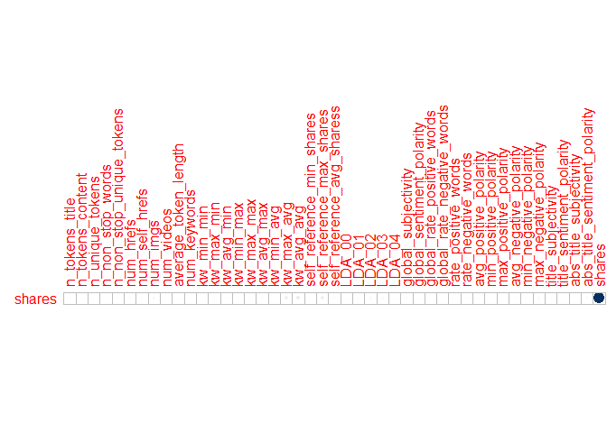
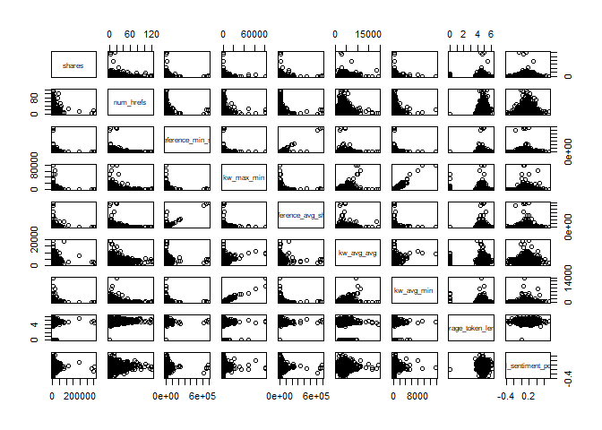
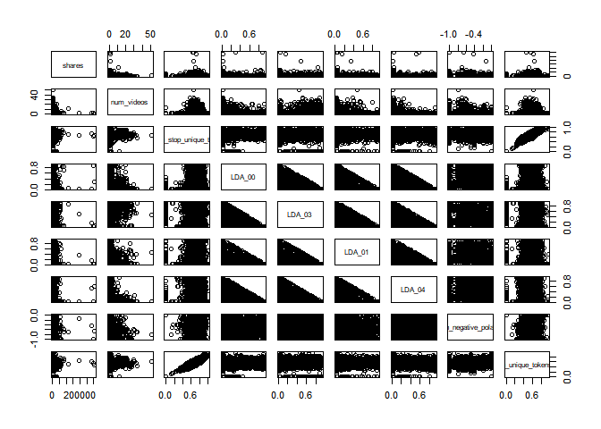

Project 2
================
Jackie Steffan
10/16/2020

``` r
#load in required packages
library(tidyverse)
library(corrplot)
library(ggplot2)
library(GGally)
library(tree)
library(caret)
library(gbm)
library(rpart)
library(rmarkdown)
```

# Introduction

This data set looks at articles that were published on the website
Mashable. The articles included were published over a 2 year period. The
goal of the data set was to look at the frequency of sharing and the
popularity of each article. According to the data documentation, the
variables url and timedelta are non-predicitve, so I chose not to use
them.  
This analysis is intended to predict the number of shares an article
will have based on other factors such as word count, number of pictures,
etc. I am using 2 tree methods that you will see later in this document.
One is a non-ensemble regression tree and the other is a bosoted tree.

# Data

In this section I am reading in the data described above.  
I then separate the data into a training data set that contains 70% of
the data and a testing data set that contains the remaining 30% of the
data.

``` r
#read in data
popData <- read_csv("./OnlineNewsPopularity.csv")
```

    ## Parsed with column specification:
    ## cols(
    ##   .default = col_double(),
    ##   url = col_character()
    ## )

    ## See spec(...) for full column specifications.

``` r
#combine boolean varaibles to make them easier to work with using mutate
popData <- popData %>% mutate(weekday = ifelse(weekday_is_monday == 1, "Monday", 
                                    ifelse(weekday_is_tuesday == 1, "Tuesday",
                                           ifelse(weekday_is_wednesday==1, "Wednesday",
                                                  ifelse(weekday_is_thursday==1, "Thursday",
                                                         ifelse(weekday_is_friday==1, "Friday",
                                                                ifelse(weekday_is_saturday==1, "Saturday", "Sunday"))))))) %>%
  mutate(channel_type = ifelse(data_channel_is_lifestyle == 1, "Lifestyle",
                               ifelse(data_channel_is_entertainment ==1, "Entertainment",
                                      ifelse(data_channel_is_bus ==1, "Business",
                                             ifelse(data_channel_is_socmed ==1, "Social Media",
                                                    ifelse(data_channel_is_tech == 1, "Tech",
                                                           ifelse(data_channel_is_world ==1, "World", "Other"))))))) %>%
                                    select(-starts_with("weekday_is"), -starts_with("data_channel"))

#filter to select appropriate weekday
weekdayDat <- filter(popData, weekday== params$weekday)

#set seed for reproducibility
set.seed(5)
#split into training and test sets
train <- sample(1:nrow(weekdayDat), size = nrow(weekdayDat)*0.7)
test <- dplyr::setdiff(1:nrow(weekdayDat), train)
DayTrain <- weekdayDat[train, ]
DayTest <- weekdayDat[test, ]
```

# Summarization

Here I am creating summaries for all the predictive variables that are
numeric, the summaries included are min, max, median, mean, and the
first and 3rd quantiles. I am also including a correlation plot that
shows the correlation between our response variable, shares, and the
other predictive numeric variables. Lastly I included a pairs plot of
the response variable and some other predictive variables, which shows
what the 2 variables look like plotted against one another.

``` r
#summary of numeric variables
summary(select(DayTrain,-c("url", "weekday", "timedelta", "channel_type", "is_weekend")))
```

    ##  n_tokens_title  n_tokens_content n_unique_tokens  n_non_stop_words n_non_stop_unique_tokens   num_hrefs      num_self_hrefs     num_imgs      
    ##  Min.   : 3.00   Min.   :   0.0   Min.   :0.0000   Min.   :0.0000   Min.   :0.0000           Min.   :  0.00   Min.   : 0.00   Min.   :  0.000  
    ##  1st Qu.: 9.00   1st Qu.: 244.0   1st Qu.:0.4742   1st Qu.:1.0000   1st Qu.:0.6269           1st Qu.:  4.00   1st Qu.: 1.00   1st Qu.:  1.000  
    ##  Median :10.00   Median : 395.0   Median :0.5430   Median :1.0000   Median :0.6927           Median :  7.00   Median : 2.00   Median :  1.000  
    ##  Mean   :10.34   Mean   : 536.1   Mean   :0.5333   Mean   :0.9727   Mean   :0.6756           Mean   : 10.67   Mean   : 3.16   Mean   :  4.527  
    ##  3rd Qu.:12.00   3rd Qu.: 698.0   3rd Qu.:0.6098   3rd Qu.:1.0000   3rd Qu.:0.7548           3rd Qu.: 13.00   3rd Qu.: 4.00   3rd Qu.:  4.000  
    ##  Max.   :20.00   Max.   :6159.0   Max.   :0.9545   Max.   :1.0000   Max.   :1.0000           Max.   :120.00   Max.   :56.00   Max.   :100.000  
    ##    num_videos     average_token_length  num_keywords      kw_min_min       kw_max_min      kw_avg_min        kw_min_max       kw_max_max    
    ##  Min.   : 0.000   Min.   :0.000        Min.   : 1.000   Min.   : -1.00   Min.   :    0   Min.   :   -1.0   Min.   :     0   Min.   : 15000  
    ##  1st Qu.: 0.000   1st Qu.:4.484        1st Qu.: 6.000   1st Qu.: -1.00   1st Qu.:  445   1st Qu.:  144.6   1st Qu.:     0   1st Qu.:843300  
    ##  Median : 0.000   Median :4.676        Median : 7.000   Median : -1.00   Median :  651   Median :  238.9   Median :  1300   Median :843300  
    ##  Mean   : 1.161   Mean   :4.562        Mean   : 7.181   Mean   : 27.81   Mean   : 1079   Mean   :  302.3   Mean   : 14318   Mean   :749139  
    ##  3rd Qu.: 1.000   3rd Qu.:4.863        3rd Qu.: 9.000   3rd Qu.:  4.00   3rd Qu.: 1000   3rd Qu.:  354.5   3rd Qu.:  7900   3rd Qu.:843300  
    ##  Max.   :51.000   Max.   :6.198        Max.   :10.000   Max.   :377.00   Max.   :80400   Max.   :13744.8   Max.   :843300   Max.   :843300  
    ##    kw_avg_max       kw_min_avg       kw_max_avg      kw_avg_avg      self_reference_min_shares self_reference_max_shares
    ##  Min.   :  3842   Min.   :   0.0   Min.   : 2241   Min.   :  675.2   Min.   :     0            Min.   :     0           
    ##  1st Qu.:171327   1st Qu.:   0.0   1st Qu.: 3573   1st Qu.: 2372.2   1st Qu.:   596            1st Qu.:  1000           
    ##  Median :245686   Median : 980.5   Median : 4313   Median : 2849.8   Median :  1200            Median :  2800           
    ##  Mean   :261054   Mean   :1098.3   Mean   : 5561   Mean   : 3111.4   Mean   :  4076            Mean   :  9790           
    ##  3rd Qu.:334128   3rd Qu.:2045.7   3rd Qu.: 6010   3rd Qu.: 3578.7   3rd Qu.:  2500            3rd Qu.:  7800           
    ##  Max.   :843300   Max.   :3610.1   Max.   :98032   Max.   :19429.3   Max.   :690400            Max.   :690400           
    ##  self_reference_avg_sharess     LDA_00            LDA_01            LDA_02            LDA_03            LDA_04        global_subjectivity
    ##  Min.   :     0.0           Min.   :0.01818   Min.   :0.01818   Min.   :0.01818   Min.   :0.01818   Min.   :0.01818   Min.   :0.0000     
    ##  1st Qu.:   940.8           1st Qu.:0.02518   1st Qu.:0.02501   1st Qu.:0.02857   1st Qu.:0.02567   1st Qu.:0.02857   1st Qu.:0.3963     
    ##  Median :  2200.0           Median :0.03363   Median :0.03335   Median :0.04001   Median :0.04000   Median :0.05000   Median :0.4526     
    ##  Mean   :  6303.8           Mean   :0.19691   Mean   :0.13809   Mean   :0.21508   Mean   :0.21676   Mean   :0.23317   Mean   :0.4435     
    ##  3rd Qu.:  5100.0           3rd Qu.:0.27598   3rd Qu.:0.15114   3rd Qu.:0.32399   3rd Qu.:0.35336   3rd Qu.:0.40045   3rd Qu.:0.5087     
    ##  Max.   :690400.0           Max.   :0.92000   Max.   :0.91997   Max.   :0.92000   Max.   :0.91994   Max.   :0.91999   Max.   :0.9375     
    ##  global_sentiment_polarity global_rate_positive_words global_rate_negative_words rate_positive_words rate_negative_words avg_positive_polarity
    ##  Min.   :-0.37766          Min.   :0.00000            Min.   :0.000000           Min.   :0.0000      Min.   :0.0000      Min.   :0.0000       
    ##  1st Qu.: 0.05795          1st Qu.:0.02878            1st Qu.:0.009585           1st Qu.:0.6000      1st Qu.:0.1834      1st Qu.:0.3051       
    ##  Median : 0.12012          Median :0.03906            Median :0.015504           Median :0.7143      Median :0.2804      Median :0.3576       
    ##  Mean   : 0.11996          Mean   :0.03959            Mean   :0.016652           Mean   :0.6839      Mean   :0.2887      Mean   :0.3528       
    ##  3rd Qu.: 0.17823          3rd Qu.:0.05031            3rd Qu.:0.021739           3rd Qu.:0.8000      3rd Qu.:0.3792      3rd Qu.:0.4117       
    ##  Max.   : 0.72784          Max.   :0.15278            Max.   :0.162037           Max.   :1.0000      Max.   :1.0000      Max.   :0.8500       
    ##  min_positive_polarity max_positive_polarity avg_negative_polarity min_negative_polarity max_negative_polarity title_subjectivity
    ##  Min.   :0.00000       Min.   :0.0000        Min.   :-1.0000       Min.   :-1.0000       Min.   :-1.0000       Min.   :0.0000    
    ##  1st Qu.:0.05000       1st Qu.:0.6000        1st Qu.:-0.3263       1st Qu.:-0.7000       1st Qu.:-0.1250       1st Qu.:0.0000    
    ##  Median :0.10000       Median :0.8000        Median :-0.2502       Median :-0.5000       Median :-0.1000       Median :0.1667    
    ##  Mean   :0.09608       Mean   :0.7532        Mean   :-0.2576       Mean   :-0.5165       Mean   :-0.1076       Mean   :0.2865    
    ##  3rd Qu.:0.10000       3rd Qu.:1.0000        3rd Qu.:-0.1843       3rd Qu.:-0.3000       3rd Qu.:-0.0500       3rd Qu.:0.5000    
    ##  Max.   :0.80000       Max.   :1.0000        Max.   : 0.0000       Max.   : 0.0000       Max.   : 0.0000       Max.   :1.0000    
    ##  title_sentiment_polarity abs_title_subjectivity abs_title_sentiment_polarity     shares        
    ##  Min.   :-1.0000          Min.   :0.0000         Min.   :0.0000               Min.   :    22.0  
    ##  1st Qu.: 0.0000          1st Qu.:0.1667         1st Qu.:0.0000               1st Qu.:   899.2  
    ##  Median : 0.0000          Median :0.5000         Median :0.0000               Median :  1400.0  
    ##  Mean   : 0.0720          Mean   :0.3428         Mean   :0.1567               Mean   :  3169.5  
    ##  3rd Qu.: 0.1396          3rd Qu.:0.5000         3rd Qu.:0.2500               3rd Qu.:  2600.0  
    ##  Max.   : 1.0000          Max.   :0.5000         Max.   :1.0000               Max.   :306100.0

``` r
#correlation of selected variables
cors <- cor(select(DayTrain, -url, -timedelta, -weekday, -channel_type, -is_weekend))
#correlation plot showing just correlation with the response variable shares
corrplot(cors["shares",,drop=FALSE], type = "upper", tl.pos = "lt",cl.pos = "n")
```

<!-- -->

``` r
#pairs data with selected variables
pairs(select(DayTrain, shares, num_hrefs, self_reference_min_shares, kw_max_min, self_reference_avg_sharess, kw_avg_avg, kw_avg_min, average_token_length, global_sentiment_polarity))
```

<!-- -->

``` r
pairs(select(DayTrain, shares,num_videos, n_non_stop_unique_tokens, LDA_00, LDA_03, LDA_01, LDA_04, min_negative_polarity, n_unique_tokens))
```

<!-- -->

# Models

In this section I am creating 2 tree models. The first is a non-ensemble
based tree selected using leave one out cross-validation. I am also
using cp between 0 and 0.2 for my tuning parameter. The final model is
printed below.  
The second model is a boosted tree selected using repeated cross
validation and the default tuning parameters. The final model is also
printed in the output.  
Lastly, you will find a comparison of RMSE, when deciding which model is
the “better” model you should select the one that has the lower RMSE.

``` r
#select relevant datapoints
treeDat <- select(DayTrain,-c("url", "weekday", "is_weekend", "timedelta"))
#build regression tree using rpart and train using LOOCV and tuning parameter cp
classTree <- train(shares~., data= select(DayTrain,-url, -weekday, -is_weekend, -timedelta), 
                   method= "rpart",
                   trControl = trainControl(method = "LOOCV"),
                   tuneGrid = data.frame(cp=0:0.2),
                   metric = "MAE")
#print results of tree
classTree$results
```

    ##   cp     RMSE    Rsquared      MAE
    ## 1  0 10497.12 0.001732272 3413.992

``` r
#predict the number of shares on the test dataset using the above tree
pred<- predict(classTree, newdata = select(DayTest, -c("url", starts_with("weekday_is"), "is_weekend")))
#calculate RMSE
trRMSE<- sqrt(mean((pred-DayTest$shares)^2))


#boosted model
#build boosted tree using gbm and train with repeated cross validation and default tuning parameters.
boostTree <- train(shares ~ ., data = treeDat, method = "gbm",
                   trControl = trainControl(method = "repeatedcv", number = 10, repeats = 5),
                   preProcess = c("center", "scale"), verbose = FALSE)
#print results of boosted tree
boostTree$results
```

    ##   shrinkage interaction.depth n.minobsinnode n.trees     RMSE   Rsquared      MAE   RMSESD RsquaredSD    MAESD
    ## 1       0.1                 1             10      50 8416.822 0.02122003 2906.229 4491.917 0.02256601 362.0431
    ## 4       0.1                 2             10      50 8610.555 0.01341078 2960.061 4387.289 0.01549888 339.6715
    ## 7       0.1                 3             10      50 8664.657 0.01380771 2978.701 4379.440 0.01698318 365.2998
    ## 2       0.1                 1             10     100 8451.245 0.02198772 2915.655 4469.482 0.02161919 351.0686
    ## 5       0.1                 2             10     100 8722.469 0.01316167 3009.100 4338.780 0.01611252 337.6875
    ## 8       0.1                 3             10     100 8757.924 0.01454810 3034.881 4327.583 0.01734331 353.6450
    ## 3       0.1                 1             10     150 8455.352 0.02314915 2924.537 4462.078 0.02152508 344.7486
    ## 6       0.1                 2             10     150 8774.358 0.01364033 3051.589 4318.654 0.01687851 335.5763
    ## 9       0.1                 3             10     150 8817.308 0.01563382 3099.438 4293.384 0.01905445 336.8006

``` r
#print best tree
boostTree$bestTune
```

    ##   n.trees interaction.depth shrinkage n.minobsinnode
    ## 1      50                 1       0.1             10

``` r
#predict number of shares on the test data set using the boosted tree
boostPred <- predict(boostTree, newdata = select(DayTest, -c("url", starts_with("weekday_is"), "is_weekend")), n.trees = 5000)
#calculate RMSE
boostRMSE<- sqrt(mean((boostPred-DayTest$shares)^2))


#print RMSE for both models and compare results.
c(tree = trRMSE, boost = boostRMSE)
```

    ##     tree    boost 
    ## 9770.388 9111.352
