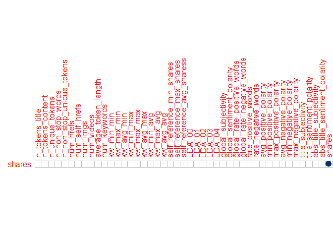
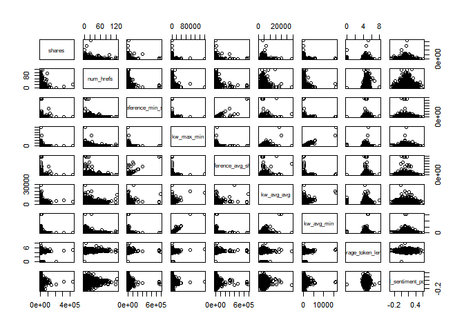
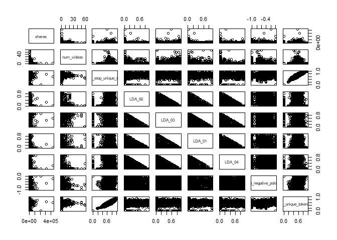

Project 2
================
Jackie Steffan
10/16/2020

``` r
#load in required packages
library(tidyverse)
library(corrplot)
library(ggplot2)
library(GGally)
library(tree)
library(caret)
library(gbm)
library(rpart)
library(rmarkdown)
library(knitr)
```

# Introduction

This data set looks at articles that were published on the website
Mashable. The articles included were published over a 2 year period. The
goal of the data set was to look at the frequency of sharing and the
popularity of each article. According to the data documentation, the
variables url and timedelta are non-predicitve, so I chose not to use
them.  
This analysis is intended to predict the number of shares an article
will have based on other factors such as word count, number of pictures,
etc. I am using 2 tree methods that you will see later in this document.
One is a non-ensemble regression tree and the other is a bosoted tree.

# Data

In this section I am reading in the data described above.  
I then separate the data into a training data set that contains 70% of
the data and a testing data set that contains the remaining 30% of the
data.

``` r
#read in data
popData <- read_csv("./OnlineNewsPopularity.csv")
```

    ## Parsed with column specification:
    ## cols(
    ##   .default = col_double(),
    ##   url = col_character()
    ## )

    ## See spec(...) for full column specifications.

``` r
#combine boolean varaibles to make them easier to work with using mutate
popData <- popData %>% mutate(weekday = ifelse(weekday_is_monday == 1, "Monday", 
                                    ifelse(weekday_is_tuesday == 1, "Tuesday",
                                           ifelse(weekday_is_wednesday==1, "Wednesday",
                                                  ifelse(weekday_is_thursday==1, "Thursday",
                                                         ifelse(weekday_is_friday==1, "Friday",
                                                                ifelse(weekday_is_saturday==1, "Saturday", "Sunday"))))))) %>%
  mutate(channel_type = ifelse(data_channel_is_lifestyle == 1, "Lifestyle",
                               ifelse(data_channel_is_entertainment ==1, "Entertainment",
                                      ifelse(data_channel_is_bus ==1, "Business",
                                             ifelse(data_channel_is_socmed ==1, "Social Media",
                                                    ifelse(data_channel_is_tech == 1, "Tech",
                                                           ifelse(data_channel_is_world ==1, "World", "Other"))))))) %>%
                                    select(-starts_with("weekday_is"), -starts_with("data_channel"))

#filter to select appropriate weekday
weekdayDat <- filter(popData, weekday == params$weekday)

#set seed for reproducibility
set.seed(5)
#split into training and test sets
train <- sample(1:nrow(weekdayDat), size = nrow(weekdayDat)*0.7)
test <- dplyr::setdiff(1:nrow(weekdayDat), train)
DayTrain <- weekdayDat[train, ]
DayTest <- weekdayDat[test, ]
```

# Summarization

Here I am creating summaries for all the predictive variables that are
numeric, the summaries included are min, max, median, mean, and the
first and 3rd quantiles. I am also including a correlation plot that
shows the correlation between our response variable, shares, and the
other predictive numeric variables. Lastly I included a pairs plot of
the response variable and some other predictive variables, which shows
what the 2 variables look like plotted against one another.

``` r
#summary of numeric variables
summary(select(DayTrain,-c("url", "weekday", "timedelta", "channel_type", "is_weekend")))
```

    ##  n_tokens_title  n_tokens_content n_unique_tokens  n_non_stop_words n_non_stop_unique_tokens
    ##  Min.   : 4.00   Min.   :   0.0   Min.   :0.0000   Min.   :0.0000   Min.   :0.0000          
    ##  1st Qu.: 9.00   1st Qu.: 248.0   1st Qu.:0.4743   1st Qu.:1.0000   1st Qu.:0.6287          
    ##  Median :10.00   Median : 396.0   Median :0.5410   Median :1.0000   Median :0.6911          
    ##  Mean   :10.45   Mean   : 541.2   Mean   :0.5309   Mean   :0.9704   Mean   :0.6724          
    ##  3rd Qu.:12.00   3rd Qu.: 691.0   3rd Qu.:0.6075   3rd Qu.:1.0000   3rd Qu.:0.7525          
    ##  Max.   :19.00   Max.   :5530.0   Max.   :0.9730   Max.   :1.0000   Max.   :1.0000          
    ##    num_hrefs      num_self_hrefs      num_imgs        num_videos     average_token_length  num_keywords   
    ##  Min.   :  0.00   Min.   : 0.000   Min.   : 0.000   Min.   : 0.000   Min.   :0.000        Min.   : 1.000  
    ##  1st Qu.:  4.00   1st Qu.: 1.000   1st Qu.: 1.000   1st Qu.: 0.000   1st Qu.:4.478        1st Qu.: 6.000  
    ##  Median :  7.00   Median : 3.000   Median : 1.000   Median : 0.000   Median :4.660        Median : 7.000  
    ##  Mean   : 10.69   Mean   : 3.307   Mean   : 4.499   Mean   : 1.312   Mean   :4.545        Mean   : 7.178  
    ##  3rd Qu.: 13.00   3rd Qu.: 4.000   3rd Qu.: 4.000   3rd Qu.: 1.000   3rd Qu.:4.853        3rd Qu.: 9.000  
    ##  Max.   :122.00   Max.   :62.000   Max.   :99.000   Max.   :59.000   Max.   :7.975        Max.   :10.000  
    ##    kw_min_min      kw_max_min       kw_avg_min        kw_min_max       kw_max_max       kw_avg_max    
    ##  Min.   : -1.0   Min.   :     0   Min.   :   -1.0   Min.   :     0   Min.   : 17100   Min.   :  3460  
    ##  1st Qu.: -1.0   1st Qu.:   441   1st Qu.:  141.0   1st Qu.:     0   1st Qu.:843300   1st Qu.:173100  
    ##  Median : -1.0   Median :   659   Median :  233.7   Median :  1300   Median :843300   Median :243387  
    ##  Mean   : 25.1   Mean   :  1091   Mean   :  301.6   Mean   : 13017   Mean   :755226   Mean   :261425  
    ##  3rd Qu.:  4.0   3rd Qu.:  1000   3rd Qu.:  355.0   3rd Qu.:  8000   3rd Qu.:843300   3rd Qu.:333850  
    ##  Max.   :217.0   Max.   :139600   Max.   :15851.2   Max.   :843300   Max.   :843300   Max.   :843300  
    ##    kw_min_avg       kw_max_avg       kw_avg_avg      self_reference_min_shares self_reference_max_shares
    ##  Min.   :  -1.0   Min.   :  2019   Min.   :  784.2   Min.   :     0            Min.   :     0           
    ##  1st Qu.:   0.0   1st Qu.:  3540   1st Qu.: 2373.9   1st Qu.:   642            1st Qu.:  1100           
    ##  Median : 981.2   Median :  4309   Median : 2849.9   Median :  1200            Median :  2900           
    ##  Mean   :1110.7   Mean   :  5616   Mean   : 3133.4   Mean   :  4229            Mean   : 10472           
    ##  3rd Qu.:2070.5   3rd Qu.:  6021   3rd Qu.: 3565.8   3rd Qu.:  2700            3rd Qu.:  8300           
    ##  Max.   :3609.7   Max.   :178675   Max.   :29240.8   Max.   :690400            Max.   :843300           
    ##  self_reference_avg_sharess     LDA_00            LDA_01            LDA_02            LDA_03       
    ##  Min.   :     0             Min.   :0.01819   Min.   :0.01825   Min.   :0.01818   Min.   :0.01818  
    ##  1st Qu.:  1000             1st Qu.:0.02507   1st Qu.:0.02502   1st Qu.:0.02857   1st Qu.:0.02857  
    ##  Median :  2267             Median :0.03337   Median :0.03334   Median :0.04001   Median :0.04000  
    ##  Mean   :  6630             Mean   :0.18155   Mean   :0.13718   Mean   :0.21561   Mean   :0.22252  
    ##  3rd Qu.:  5400             3rd Qu.:0.23969   3rd Qu.:0.13673   3rd Qu.:0.32799   3rd Qu.:0.36851  
    ##  Max.   :690400             Max.   :0.91998   Max.   :0.91994   Max.   :0.92000   Max.   :0.91997  
    ##      LDA_04        global_subjectivity global_sentiment_polarity global_rate_positive_words
    ##  Min.   :0.01844   Min.   :0.0000      Min.   :-0.30881          Min.   :0.00000           
    ##  1st Qu.:0.02857   1st Qu.:0.3949      1st Qu.: 0.05865          1st Qu.:0.02857           
    ##  Median :0.05000   Median :0.4520      Median : 0.12042          Median :0.03918           
    ##  Mean   :0.24314   Mean   :0.4414      Mean   : 0.11915          Mean   :0.03969           
    ##  3rd Qu.:0.43521   3rd Qu.:0.5064      3rd Qu.: 0.17688          3rd Qu.:0.05008           
    ##  Max.   :0.92719   Max.   :0.8714      Max.   : 0.61923          Max.   :0.11458           
    ##  global_rate_negative_words rate_positive_words rate_negative_words avg_positive_polarity
    ##  Min.   :0.000000           Min.   :0.0000      Min.   :0.0000      Min.   :0.0000       
    ##  1st Qu.:0.009504           1st Qu.:0.6000      1st Qu.:0.1818      1st Qu.:0.3045       
    ##  Median :0.015177           Median :0.7143      Median :0.2759      Median :0.3567       
    ##  Mean   :0.016436           Mean   :0.6853      Mean   :0.2847      Mean   :0.3505       
    ##  3rd Qu.:0.021365           3rd Qu.:0.8000      3rd Qu.:0.3793      3rd Qu.:0.4071       
    ##  Max.   :0.135294           Max.   :1.0000      Max.   :1.0000      Max.   :0.8000       
    ##  min_positive_polarity max_positive_polarity avg_negative_polarity min_negative_polarity
    ##  Min.   :0.00000       Min.   :0.0000        Min.   :-1.0000       Min.   :-1.0000      
    ##  1st Qu.:0.05000       1st Qu.:0.6000        1st Qu.:-0.3250       1st Qu.:-0.7000      
    ##  Median :0.10000       Median :0.8000        Median :-0.2500       Median :-0.5000      
    ##  Mean   :0.09434       Mean   :0.7523        Mean   :-0.2566       Mean   :-0.5148      
    ##  3rd Qu.:0.10000       3rd Qu.:1.0000        3rd Qu.:-0.1833       3rd Qu.:-0.3000      
    ##  Max.   :0.60000       Max.   :1.0000        Max.   : 0.0000       Max.   : 0.0000      
    ##  max_negative_polarity title_subjectivity title_sentiment_polarity abs_title_subjectivity
    ##  Min.   :-1.0000       Min.   :0.0000     Min.   :-1.00000         Min.   :0.0000        
    ##  1st Qu.:-0.1250       1st Qu.:0.0000     1st Qu.: 0.00000         1st Qu.:0.1667        
    ##  Median :-0.1000       Median :0.1250     Median : 0.00000         Median :0.5000        
    ##  Mean   :-0.1074       Mean   :0.2797     Mean   : 0.07156         Mean   :0.3446        
    ##  3rd Qu.:-0.0500       3rd Qu.:0.5000     3rd Qu.: 0.13636         3rd Qu.:0.5000        
    ##  Max.   : 0.0000       Max.   :1.0000     Max.   : 1.00000         Max.   :0.5000        
    ##  abs_title_sentiment_polarity     shares      
    ##  Min.   :0.000                Min.   :    42  
    ##  1st Qu.:0.000                1st Qu.:   900  
    ##  Median :0.000                Median :  1300  
    ##  Mean   :0.157                Mean   :  3262  
    ##  3rd Qu.:0.250                3rd Qu.:  2500  
    ##  Max.   :1.000                Max.   :441000

``` r
#correlation of selected variables
cors <- cor(select(DayTrain, -url, -timedelta, -weekday, -channel_type, -is_weekend))
#correlation plot showing just correlation with the response variable shares
corrplot(cors["shares",,drop=FALSE], type = "upper", tl.pos = "lt",cl.pos = "n")
```

<!-- -->

``` r
#pairs data with selected variables
pairs(select(DayTrain, shares, num_hrefs, self_reference_min_shares, kw_max_min, self_reference_avg_sharess, kw_avg_avg, kw_avg_min, average_token_length, global_sentiment_polarity))
```

<!-- -->

``` r
pairs(select(DayTrain, shares,num_videos, n_non_stop_unique_tokens, LDA_00, LDA_03, LDA_01, LDA_04, min_negative_polarity, n_unique_tokens))
```

<!-- -->

# Models

In this section I am creating 2 tree models. The first is a non-ensemble
based tree selected using leave one out cross-validation. I am also
using cp between 0 and 0.2 for my tuning parameter. The final model is
printed below.  
The second model is a boosted tree selected using repeated cross
validation and the default tuning parameters. The final model is also
printed in the output.  
Lastly, you will find a comparison of RMSE, when deciding which model is
the “better” model you should select the one that has the lower RMSE.

``` r
#select relevant datapoints
treeDat <- select(DayTrain,-c("url", "weekday", "is_weekend", "timedelta"))
#build regression tree using rpart and train using LOOCV and tuning parameter cp
classTree <- train(shares~., data= select(DayTrain,-url, -weekday, -is_weekend, -timedelta), 
                   method= "rpart",
                   trControl = trainControl(method = "LOOCV"),
                   tuneGrid = data.frame(cp=0:0.2),
                   metric = "MAE")
#print results of tree
classTree$results
```

    ##   cp     RMSE    Rsquared      MAE
    ## 1  0 11717.55 0.003146384 3443.598

``` r
#predict the number of shares on the test dataset using the above tree
pred<- predict(classTree, newdata = select(DayTest, -c("url", starts_with("weekday_is"), "is_weekend")))
#calculate RMSE
trRMSE<- sqrt(mean((pred-DayTest$shares)^2))


#boosted model
#build boosted tree using gbm and train with repeated cross validation and default tuning parameters.
gbmGrid <-  expand.grid(interaction.depth = c(1, 5, 9), 
                        n.trees = (1:3)*50, 
                        shrinkage = c(0.1, 0.2),
                        n.minobsinnode = c(10,20))
boostTree <- train(shares ~ ., data = treeDat, method = "gbm",
                   trControl = trainControl(method = "repeatedcv", number = 10, repeats = 5),
                   preProcess = c("center", "scale"), verbose = FALSE,
                   tuneGrid = gbmGrid)
#print results of boosted tree
boostTree$results
```

    ##    shrinkage interaction.depth n.minobsinnode n.trees      RMSE    Rsquared      MAE   RMSESD  RsquaredSD
    ## 1        0.1                 1             10      50  9373.310 0.032231981 3048.861 5042.570 0.028923573
    ## 4        0.1                 1             20      50  9369.923 0.032594569 3044.330 5038.419 0.028703016
    ## 19       0.2                 1             10      50  9418.890 0.030521617 3069.141 5017.909 0.028930422
    ## 22       0.2                 1             20      50  9406.015 0.032695225 3065.702 5017.579 0.027272258
    ## 7        0.1                 5             10      50  9720.630 0.020817111 3187.857 4885.609 0.025009900
    ## 10       0.1                 5             20      50  9587.038 0.023070884 3168.803 4932.184 0.017906390
    ## 25       0.2                 5             10      50 10143.270 0.012397016 3471.536 4707.120 0.015801577
    ## 28       0.2                 5             20      50  9878.042 0.017753631 3406.540 4787.714 0.017600695
    ## 13       0.1                 9             10      50  9760.034 0.021116008 3255.768 4822.721 0.024078284
    ## 16       0.1                 9             20      50  9591.288 0.024730087 3171.772 4930.280 0.024107831
    ## 31       0.2                 9             10      50 10353.761 0.011543352 3680.088 4596.116 0.012702538
    ## 34       0.2                 9             20      50  9903.988 0.018712679 3502.708 4788.178 0.021198959
    ## 2        0.1                 1             10     100  9415.690 0.032250136 3071.506 5020.210 0.029464252
    ## 5        0.1                 1             20     100  9397.864 0.032876838 3057.680 5022.621 0.028861106
    ## 20       0.2                 1             10     100  9455.543 0.029376555 3099.708 5003.755 0.025305376
    ## 23       0.2                 1             20     100  9434.039 0.030958760 3094.183 5005.932 0.024876714
    ## 8        0.1                 5             10     100  9924.007 0.016547496 3349.122 4815.319 0.016336429
    ## 11       0.1                 5             20     100  9742.456 0.018250107 3292.644 4868.748 0.015308337
    ## 26       0.2                 5             10     100 10511.193 0.010139713 3787.402 4565.833 0.014250728
    ## 29       0.2                 5             20     100 10167.928 0.012309088 3700.878 4680.649 0.012485232
    ## 14       0.1                 9             10     100 10026.187 0.016640272 3460.846 4703.145 0.016709760
    ## 17       0.1                 9             20     100  9793.409 0.017696733 3346.161 4846.339 0.016356797
    ## 32       0.2                 9             10     100 10748.450 0.009840980 4053.191 4440.652 0.011206517
    ## 35       0.2                 9             20     100 10238.402 0.013482274 3863.610 4657.495 0.016998686
    ## 3        0.1                 1             10     150  9421.780 0.032713654 3071.609 5017.178 0.028937609
    ## 6        0.1                 1             20     150  9417.792 0.031502626 3064.118 5019.765 0.028240879
    ## 21       0.2                 1             10     150  9480.137 0.028708757 3124.380 4993.029 0.025857709
    ## 24       0.2                 1             20     150  9457.638 0.030118401 3122.366 5006.640 0.027064830
    ## 9        0.1                 5             10     150 10078.830 0.014884446 3480.174 4750.213 0.015139457
    ## 12       0.1                 5             20     150  9854.015 0.015689256 3400.084 4837.698 0.013597090
    ## 27       0.2                 5             10     150 10748.271 0.008983848 4028.061 4450.922 0.013810395
    ## 30       0.2                 5             20     150 10361.202 0.012252266 3935.529 4609.337 0.014395687
    ## 15       0.1                 9             10     150 10195.333 0.015205572 3608.797 4630.045 0.016576933
    ## 18       0.1                 9             20     150  9948.998 0.015437953 3504.717 4783.115 0.015919134
    ## 33       0.2                 9             10     150 10953.554 0.009149751 4298.416 4353.217 0.008895488
    ## 36       0.2                 9             20     150 10452.948 0.012675552 4110.425 4582.647 0.015720427
    ##       MAESD
    ## 1  448.5803
    ## 4  442.2574
    ## 19 450.4378
    ## 22 441.1513
    ## 7  424.5127
    ## 10 431.8720
    ## 25 413.0330
    ## 28 389.6175
    ## 13 395.5369
    ## 16 409.7847
    ## 31 370.8176
    ## 34 382.3640
    ## 2  445.0265
    ## 5  442.4504
    ## 20 438.7099
    ## 23 433.6519
    ## 8  405.5801
    ## 11 410.2986
    ## 26 372.1230
    ## 29 344.6002
    ## 14 365.0490
    ## 17 386.5346
    ## 32 341.1391
    ## 35 339.8765
    ## 3  437.9580
    ## 6  437.7350
    ## 21 432.3935
    ## 24 434.1362
    ## 9  379.5305
    ## 12 409.5842
    ## 27 344.7322
    ## 30 326.6082
    ## 15 349.0067
    ## 18 355.9761
    ## 33 323.8770
    ## 36 337.0290

``` r
#print best tree
boostTree$bestTune
```

    ##   n.trees interaction.depth shrinkage n.minobsinnode
    ## 4      50                 1       0.1             20

``` r
#predict number of shares on the test data set using the boosted tree
boostPred <- predict(boostTree, newdata = select(DayTest, -c("url", starts_with("weekday_is"), "is_weekend")), n.trees = 5000)
#calculate RMSE
boostRMSE<- sqrt(mean((boostPred-DayTest$shares)^2))


#print RMSE for both models and compare results.
c(tree = trRMSE, boost = boostRMSE)
```

    ##     tree    boost 
    ## 8545.452 7313.465

# Linear Regression Model

This part of the code was added by Hannah Park as part II of the
project. Here, a linear regression model is fit on the training data set
using the same predictor variables as those used in the two tree models.
Then, predictions of the model are made on the test data set, and the
test MSE from the linear regression model is compared to those of the
tree models.

``` r
# Fit a linear regression
linReg <- train(shares ~ .,
                data = select(DayTrain,-url, -weekday, -is_weekend, -timedelta),
                method = "lm",
                trControl = trainControl(method = "cv", number = 10))
summary(linReg)
```

    ## 
    ## Call:
    ## lm(formula = .outcome ~ ., data = dat)
    ## 
    ## Residuals:
    ##    Min     1Q Median     3Q    Max 
    ## -22034  -2321  -1087    231 434911 
    ## 
    ## Coefficients: (1 not defined because of singularities)
    ##                                Estimate Std. Error t value Pr(>|t|)    
    ## (Intercept)                  -9.751e+02  2.179e+03  -0.448 0.654472    
    ## n_tokens_title                1.088e+02  7.339e+01   1.483 0.138198    
    ## n_tokens_content              9.230e-01  5.860e-01   1.575 0.115292    
    ## n_unique_tokens               7.699e+03  4.956e+03   1.553 0.120402    
    ## n_non_stop_words             -7.528e+03  8.243e+03  -0.913 0.361149    
    ## n_non_stop_unique_tokens     -4.267e+03  4.138e+03  -1.031 0.302522    
    ## num_hrefs                     2.316e+01  1.832e+01   1.264 0.206274    
    ## num_self_hrefs               -2.643e+01  4.978e+01  -0.531 0.595468    
    ## num_imgs                      1.085e+01  2.290e+01   0.474 0.635724    
    ## num_videos                   -6.268e+00  4.133e+01  -0.152 0.879468    
    ## average_token_length         -2.887e+01  6.190e+02  -0.047 0.962802    
    ## num_keywords                  1.248e+02  9.582e+01   1.303 0.192681    
    ## kw_min_min                    2.290e+00  4.380e+00   0.523 0.601187    
    ## kw_max_min                    4.749e-02  1.720e-01   0.276 0.782457    
    ## kw_avg_min                   -3.928e-01  1.140e+00  -0.345 0.730443    
    ## kw_min_max                   -6.575e-03  3.195e-03  -2.058 0.039632 *  
    ## kw_max_max                   -8.813e-04  1.575e-03  -0.560 0.575837    
    ## kw_avg_max                    1.867e-03  2.149e-03   0.869 0.384826    
    ## kw_min_avg                   -1.269e-01  1.986e-01  -0.639 0.522814    
    ## kw_max_avg                   -2.210e-01  6.537e-02  -3.381 0.000727 ***
    ## kw_avg_avg                    1.617e+00  3.978e-01   4.065 4.87e-05 ***
    ## self_reference_min_shares     1.356e-02  2.110e-02   0.643 0.520468    
    ## self_reference_max_shares    -1.159e-02  1.261e-02  -0.919 0.358018    
    ## self_reference_avg_sharess    2.802e-02  3.095e-02   0.905 0.365330    
    ## LDA_00                       -1.122e+03  1.154e+03  -0.972 0.331088    
    ## LDA_01                        5.987e+02  1.296e+03   0.462 0.644034    
    ## LDA_02                       -1.165e+03  1.148e+03  -1.015 0.310113    
    ## LDA_03                        1.408e+03  1.239e+03   1.136 0.255888    
    ## LDA_04                               NA         NA      NA       NA    
    ## global_subjectivity           4.840e+03  2.195e+03   2.205 0.027495 *  
    ## global_sentiment_polarity    -2.053e+02  4.330e+03  -0.047 0.962180    
    ## global_rate_positive_words   -2.534e+04  1.903e+04  -1.332 0.182993    
    ## global_rate_negative_words    4.279e+03  3.595e+04   0.119 0.905262    
    ## rate_positive_words           2.956e+03  7.607e+03   0.389 0.697615    
    ## rate_negative_words           3.668e+03  7.846e+03   0.467 0.640218    
    ## avg_positive_polarity        -5.951e+03  3.496e+03  -1.702 0.088757 .  
    ## min_positive_polarity         5.574e+03  3.049e+03   1.828 0.067605 .  
    ## max_positive_polarity         3.410e+03  1.084e+03   3.146 0.001666 ** 
    ## avg_negative_polarity        -3.608e+02  3.237e+03  -0.111 0.911262    
    ## min_negative_polarity         1.411e+02  1.185e+03   0.119 0.905181    
    ## max_negative_polarity        -6.143e+02  2.702e+03  -0.227 0.820196    
    ## title_subjectivity           -6.884e+02  6.998e+02  -0.984 0.325320    
    ## title_sentiment_polarity      9.911e+02  6.191e+02   1.601 0.109453    
    ## abs_title_subjectivity       -4.289e+02  9.256e+02  -0.463 0.643085    
    ## abs_title_sentiment_polarity  3.836e+02  9.753e+02   0.393 0.694083    
    ## channel_typeEntertainment    -2.366e+03  9.272e+02  -2.552 0.010750 *  
    ## channel_typeLifestyle        -6.661e+02  9.631e+02  -0.692 0.489187    
    ## channel_typeOther            -1.700e+03  9.847e+02  -1.726 0.084341 .  
    ## `channel_typeSocial Media`   -4.940e+00  7.939e+02  -0.006 0.995036    
    ## channel_typeTech             -5.806e+02  8.334e+02  -0.697 0.486066    
    ## channel_typeWorld            -2.789e+02  9.042e+02  -0.308 0.757804    
    ## ---
    ## Signif. codes:  0 '***' 0.001 '**' 0.01 '*' 0.05 '.' 0.1 ' ' 1
    ## 
    ## Residual standard error: 10540 on 5123 degrees of freedom
    ## Multiple R-squared:  0.03603,    Adjusted R-squared:  0.02681 
    ## F-statistic: 3.907 on 49 and 5123 DF,  p-value: < 2.2e-16

``` r
# Make predictions using the Test set
lmPred <- predict(linReg, DayTest)
DayTest$predictions <- lmPred
kable(head(select(DayTest, shares, predictions)))
```

| shares | predictions |
| -----: | ----------: |
|    468 |    288.1223 |
|   4600 |   2916.0114 |
|   1300 | \-1340.7737 |
|   2400 |   3671.4720 |
|   1700 |  \-552.4357 |
|    500 |   2418.8510 |

``` r
# Compare test RMSE of lm model to those of the two tree models
lmRMSE <- sqrt(mean((lmPred - DayTest$shares)^2))
kable(c("Regression Tree" = trRMSE, 
        "Boosted Tree" = boostRMSE, 
        "Linear Regression" = lmRMSE),
      col.names = "RMSE")
```

|                   |       RMSE |
| ----------------- | ---------: |
| Regression Tree   |   8545.452 |
| Boosted Tree      |   7313.465 |
| Linear Regression | 111145.639 |
