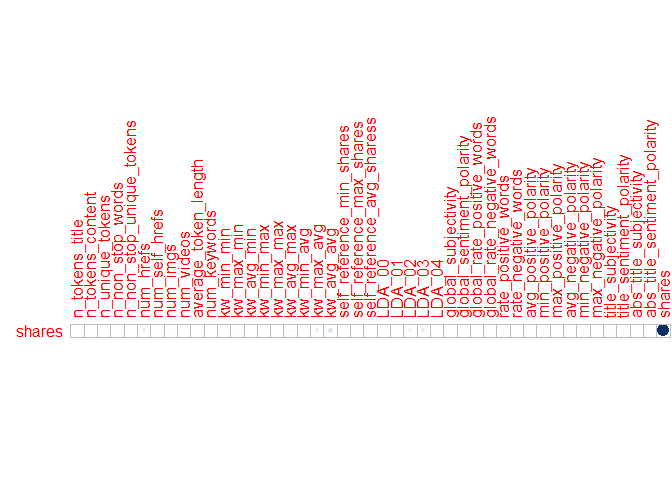
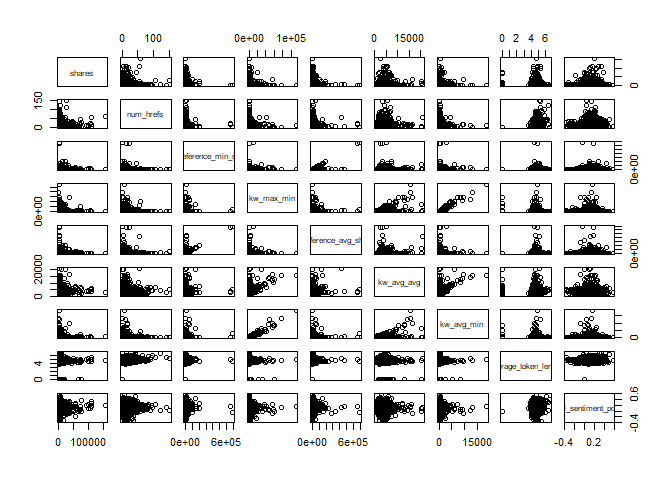
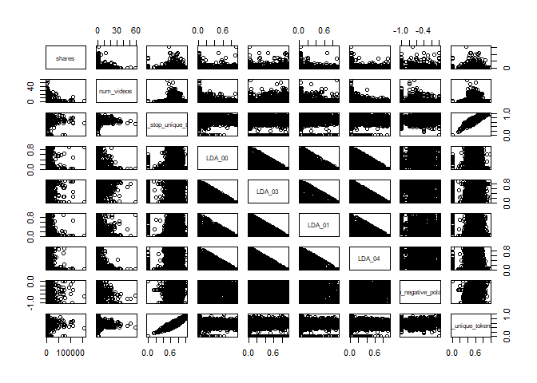

Project 2
================
Jackie Steffan
10/16/2020

``` r
#load in required packages
library(tidyverse)
library(corrplot)
library(ggplot2)
library(GGally)
library(tree)
library(caret)
library(gbm)
library(rpart)
library(rmarkdown)
```

# Introduction

This data set looks at articles that were published on the website
Mashable. The articles included were published over a 2 year period. The
goal of the data set was to look at the frequency of sharing and the
popularity of each article. According to the data documentation, the
variables url and timedelta are non-predicitve, so I chose not to use
them.  
This analysis is intended to predict the number of shares an article
will have based on other factors such as word count, number of pictures,
etc. I am using 2 tree methods that you will see later in this document.
One is a non-ensemble regression tree and the other is a bosoted tree.

# Data

In this section I am reading in the data described above.  
I then separate the data into a training data set that contains 70% of
the data and a testing data set that contains the remaining 30% of the
data.

``` r
#read in data
popData <- read_csv("./OnlineNewsPopularity.csv")
```

    ## Parsed with column specification:
    ## cols(
    ##   .default = col_double(),
    ##   url = col_character()
    ## )

    ## See spec(...) for full column specifications.

``` r
#combine boolean varaibles to make them easier to work with using mutate
popData <- popData %>% mutate(weekday = ifelse(weekday_is_monday == 1, "Monday", 
                                    ifelse(weekday_is_tuesday == 1, "Tuesday",
                                           ifelse(weekday_is_wednesday==1, "Wednesday",
                                                  ifelse(weekday_is_thursday==1, "Thursday",
                                                         ifelse(weekday_is_friday==1, "Friday",
                                                                ifelse(weekday_is_saturday==1, "Saturday", "Sunday"))))))) %>%
  mutate(channel_type = ifelse(data_channel_is_lifestyle == 1, "Lifestyle",
                               ifelse(data_channel_is_entertainment ==1, "Entertainment",
                                      ifelse(data_channel_is_bus ==1, "Business",
                                             ifelse(data_channel_is_socmed ==1, "Social Media",
                                                    ifelse(data_channel_is_tech == 1, "Tech",
                                                           ifelse(data_channel_is_world ==1, "World", "Other"))))))) %>%
                                    select(-starts_with("weekday_is"), -starts_with("data_channel"))

#filter to select appropriate weekday
weekdayDat <- filter(popData, weekday== params$weekday)

#set seed for reproducibility
set.seed(5)
#split into training and test sets
train <- sample(1:nrow(weekdayDat), size = nrow(weekdayDat)*0.7)
test <- dplyr::setdiff(1:nrow(weekdayDat), train)
DayTrain <- weekdayDat[train, ]
DayTest <- weekdayDat[test, ]
```

# Summarization

Here I am creating summaries for all the predictive variables that are
numeric, the summaries included are min, max, median, mean, and the
first and 3rd quantiles. I am also including a correlation plot that
shows the correlation between our response variable, shares, and the
other predictive numeric variables. Lastly I included a pairs plot of
the response variable and some other predictive variables, which shows
what the 2 variables look like plotted against one another.

``` r
#summary of numeric variables
summary(select(DayTrain,-c("url", "weekday", "timedelta", "channel_type", "is_weekend")))
```

    ##  n_tokens_title  n_tokens_content n_unique_tokens  n_non_stop_words n_non_stop_unique_tokens   num_hrefs      num_self_hrefs      num_imgs     
    ##  Min.   : 4.00   Min.   :   0.0   Min.   :0.0000   Min.   :0.0000   Min.   :0.0000           Min.   :  0.00   Min.   : 0.000   Min.   : 0.000  
    ##  1st Qu.: 9.00   1st Qu.: 244.0   1st Qu.:0.4726   1st Qu.:1.0000   1st Qu.:0.6278           1st Qu.:  4.00   1st Qu.: 1.000   1st Qu.: 1.000  
    ##  Median :10.00   Median : 401.0   Median :0.5408   Median :1.0000   Median :0.6927           Median :  7.00   Median : 2.000   Median : 1.000  
    ##  Mean   :10.43   Mean   : 531.1   Mean   :0.5315   Mean   :0.9693   Mean   :0.6747           Mean   : 10.15   Mean   : 3.132   Mean   : 4.096  
    ##  3rd Qu.:12.00   3rd Qu.: 701.2   3rd Qu.:0.6111   3rd Qu.:1.0000   3rd Qu.:0.7576           3rd Qu.: 12.00   3rd Qu.: 4.000   3rd Qu.: 3.000  
    ##  Max.   :18.00   Max.   :4747.0   Max.   :0.9714   Max.   :1.0000   Max.   :1.0000           Max.   :150.00   Max.   :43.000   Max.   :92.000  
    ##    num_videos     average_token_length  num_keywords      kw_min_min      kw_max_min       kw_avg_min        kw_min_max       kw_max_max    
    ##  Min.   : 0.000   Min.   :0.000        Min.   : 1.000   Min.   : -1.0   Min.   :     0   Min.   :   -1.0   Min.   :     0   Min.   : 17100  
    ##  1st Qu.: 0.000   1st Qu.:4.478        1st Qu.: 6.000   1st Qu.: -1.0   1st Qu.:   442   1st Qu.:  141.4   1st Qu.:     0   1st Qu.:690400  
    ##  Median : 0.000   Median :4.662        Median : 7.000   Median : -1.0   Median :   657   Median :  237.8   Median :  1300   Median :843300  
    ##  Mean   : 1.239   Mean   :4.542        Mean   : 7.136   Mean   : 27.5   Mean   :  1187   Mean   :  319.9   Mean   : 14609   Mean   :746712  
    ##  3rd Qu.: 1.000   3rd Qu.:4.851        3rd Qu.: 9.000   3rd Qu.:  4.0   3rd Qu.:  1000   3rd Qu.:  358.1   3rd Qu.:  7300   3rd Qu.:843300  
    ##  Max.   :58.000   Max.   :6.610        Max.   :10.000   Max.   :294.0   Max.   :111300   Max.   :18687.8   Max.   :843300   Max.   :843300  
    ##    kw_avg_max       kw_min_avg     kw_max_avg       kw_avg_avg      self_reference_min_shares self_reference_max_shares
    ##  Min.   :  2240   Min.   :  -1   Min.   :  1953   Min.   :  503.4   Min.   :     0.0          Min.   :     0           
    ##  1st Qu.:171686   1st Qu.:   0   1st Qu.:  3529   1st Qu.: 2364.6   1st Qu.:   631.2          1st Qu.:  1000           
    ##  Median :245568   Median :1000   Median :  4266   Median : 2823.0   Median :  1200.0          Median :  2900           
    ##  Mean   :261087   Mean   :1084   Mean   :  5532   Mean   : 3085.4   Mean   :  4005.2          Mean   : 10131           
    ##  3rd Qu.:334905   3rd Qu.:1988   3rd Qu.:  5863   3rd Qu.: 3523.7   3rd Qu.:  2700.0          3rd Qu.:  7800           
    ##  Max.   :843300   Max.   :3613   Max.   :135125   Max.   :21000.7   Max.   :690400.0          Max.   :837700           
    ##  self_reference_avg_sharess     LDA_00            LDA_01            LDA_02            LDA_03            LDA_04        global_subjectivity
    ##  Min.   :     0.0           Min.   :0.01818   Min.   :0.01819   Min.   :0.01819   Min.   :0.01820   Min.   :0.01818   Min.   :0.0000     
    ##  1st Qu.:   963.1           1st Qu.:0.02519   1st Qu.:0.02503   1st Qu.:0.02857   1st Qu.:0.02857   1st Qu.:0.02858   1st Qu.:0.3944     
    ##  Median :  2200.0           Median :0.03351   Median :0.03335   Median :0.04002   Median :0.04000   Median :0.05000   Median :0.4507     
    ##  Mean   :  6418.6           Mean   :0.19268   Mean   :0.13545   Mean   :0.21660   Mean   :0.21522   Mean   :0.24005   Mean   :0.4420     
    ##  3rd Qu.:  5065.3           3rd Qu.:0.26865   3rd Qu.:0.14492   3rd Qu.:0.33315   3rd Qu.:0.34046   3rd Qu.:0.41687   3rd Qu.:0.5061     
    ##  Max.   :690400.0           Max.   :0.92000   Max.   :0.91998   Max.   :0.92000   Max.   :0.91998   Max.   :0.92712   Max.   :1.0000     
    ##  global_sentiment_polarity global_rate_positive_words global_rate_negative_words rate_positive_words rate_negative_words avg_positive_polarity
    ##  Min.   :-0.37500          Min.   :0.00000            Min.   :0.000000           Min.   :0.0000      Min.   :0.0000      Min.   :0.0000       
    ##  1st Qu.: 0.05949          1st Qu.:0.02817            1st Qu.:0.009434           1st Qu.:0.6000      1st Qu.:0.1818      1st Qu.:0.3067       
    ##  Median : 0.11988          Median :0.03880            Median :0.015038           Median :0.7143      Median :0.2753      Median :0.3590       
    ##  Mean   : 0.11857          Mean   :0.03948            Mean   :0.016287           Mean   :0.6849      Mean   :0.2844      Mean   :0.3524       
    ##  3rd Qu.: 0.17779          3rd Qu.:0.04968            3rd Qu.:0.021390           3rd Qu.:0.8057      3rd Qu.:0.3824      3rd Qu.:0.4086       
    ##  Max.   : 0.57374          Max.   :0.15549            Max.   :0.085897           Max.   :1.0000      Max.   :1.0000      Max.   :1.0000       
    ##  min_positive_polarity max_positive_polarity avg_negative_polarity min_negative_polarity max_negative_polarity title_subjectivity
    ##  Min.   :0.00000       Min.   :0.000         Min.   :-1.0000       Min.   :-1.0000       Min.   :-1.0000       Min.   :0.00      
    ##  1st Qu.:0.05000       1st Qu.:0.600         1st Qu.:-0.3284       1st Qu.:-0.7000       1st Qu.:-0.1250       1st Qu.:0.00      
    ##  Median :0.10000       Median :0.800         Median :-0.2506       Median :-0.5000       Median :-0.1000       Median :0.10      
    ##  Mean   :0.09518       Mean   :0.751         Mean   :-0.2582       Mean   :-0.5176       Mean   :-0.1071       Mean   :0.28      
    ##  3rd Qu.:0.10000       3rd Qu.:1.000         3rd Qu.:-0.1853       3rd Qu.:-0.3000       3rd Qu.:-0.0500       3rd Qu.:0.50      
    ##  Max.   :1.00000       Max.   :1.000         Max.   : 0.0000       Max.   : 0.0000       Max.   : 0.0000       Max.   :1.00      
    ##  title_sentiment_polarity abs_title_subjectivity abs_title_sentiment_polarity     shares      
    ##  Min.   :-1.0000          Min.   :0.0000         Min.   :0.0000               Min.   :    49  
    ##  1st Qu.: 0.0000          1st Qu.:0.1667         1st Qu.:0.0000               1st Qu.:   885  
    ##  Median : 0.0000          Median :0.5000         Median :0.0000               Median :  1300  
    ##  Mean   : 0.0660          Mean   :0.3440         Mean   :0.1533               Mean   :  3007  
    ##  3rd Qu.: 0.1364          3rd Qu.:0.5000         3rd Qu.:0.2500               3rd Qu.:  2500  
    ##  Max.   : 1.0000          Max.   :0.5000         Max.   :1.0000               Max.   :158900

``` r
#correlation of selected variables
cors <- cor(select(DayTrain, -url, -timedelta, -weekday, -channel_type, -is_weekend))
#correlation plot showing just correlation with the response variable shares
corrplot(cors["shares",,drop=FALSE], type = "upper", tl.pos = "lt",cl.pos = "n")
```

<!-- -->

``` r
#pairs data with selected variables
pairs(select(DayTrain, shares, num_hrefs, self_reference_min_shares, kw_max_min, self_reference_avg_sharess, kw_avg_avg, kw_avg_min, average_token_length, global_sentiment_polarity))
```

<!-- -->

``` r
pairs(select(DayTrain, shares,num_videos, n_non_stop_unique_tokens, LDA_00, LDA_03, LDA_01, LDA_04, min_negative_polarity, n_unique_tokens))
```

<!-- -->

# Models

In this section I am creating 2 tree models. The first is a non-ensemble
based tree selected using leave one out cross-validation. I am also
using cp between 0 and 0.2 for my tuning parameter. The final model is
printed below.  
The second model is a boosted tree selected using repeated cross
validation and the default tuning parameters. The final model is also
printed in the output.  
Lastly, you will find a comparison of RMSE, when deciding which model is
the “better” model you should select the one that has the lower RMSE.

``` r
#select relevant datapoints
treeDat <- select(DayTrain,-c("url", "weekday", "is_weekend", "timedelta"))
#build regression tree using rpart and train using LOOCV and tuning parameter cp
classTree <- train(shares~., data= select(DayTrain,-url, -weekday, -is_weekend, -timedelta), 
                   method= "rpart",
                   trControl = trainControl(method = "LOOCV"),
                   tuneGrid = data.frame(cp=0:0.2),
                   metric = "MAE")
#print results of tree
classTree$results
```

    ##   cp     RMSE  Rsquared      MAE
    ## 1  0 7595.666 0.0118088 3062.321

``` r
#predict the number of shares on the test dataset using the above tree
pred<- predict(classTree, newdata = select(DayTest, -c("url", starts_with("weekday_is"), "is_weekend")))
#calculate RMSE
trRMSE<- sqrt(mean((pred-DayTest$shares)^2))


#boosted model
#build boosted tree using gbm and train with repeated cross validation and default tuning parameters.
boostTree <- train(shares ~ ., data = treeDat, method = "gbm",
                   trControl = trainControl(method = "repeatedcv", number = 10, repeats = 5),
                   preProcess = c("center", "scale"), verbose = FALSE)
#print results of boosted tree
boostTree$results
```

    ##   shrinkage interaction.depth n.minobsinnode n.trees     RMSE   Rsquared      MAE   RMSESD RsquaredSD    MAESD
    ## 1       0.1                 1             10      50 6702.116 0.03347702 2673.124 1613.997 0.01606316 240.2797
    ## 4       0.1                 2             10      50 6766.786 0.02788560 2699.065 1584.242 0.01582950 246.1201
    ## 7       0.1                 3             10      50 6801.189 0.02816268 2714.280 1550.264 0.01955258 233.1675
    ## 2       0.1                 1             10     100 6715.767 0.03538499 2678.074 1591.394 0.01785777 234.9313
    ## 5       0.1                 2             10     100 6827.163 0.02651488 2727.876 1546.509 0.01710520 243.0183
    ## 8       0.1                 3             10     100 6868.996 0.02552229 2742.933 1517.018 0.01742460 229.5160
    ## 3       0.1                 1             10     150 6732.784 0.03394571 2692.837 1577.391 0.01752952 233.5237
    ## 6       0.1                 2             10     150 6859.300 0.02545557 2739.318 1528.061 0.01696425 240.7396
    ## 9       0.1                 3             10     150 6922.941 0.02349084 2767.108 1508.972 0.01602024 233.5233

``` r
#print best tree
boostTree$bestTune
```

    ##   n.trees interaction.depth shrinkage n.minobsinnode
    ## 1      50                 1       0.1             10

``` r
#predict number of shares on the test data set using the boosted tree
boostPred <- predict(boostTree, newdata = select(DayTest, -c("url", starts_with("weekday_is"), "is_weekend")), n.trees = 5000)
#calculate RMSE
boostRMSE<- sqrt(mean((boostPred-DayTest$shares)^2))


#print RMSE for both models and compare results.
c(tree = trRMSE, boost = boostRMSE)
```

    ##     tree    boost 
    ## 24533.78 24277.83
