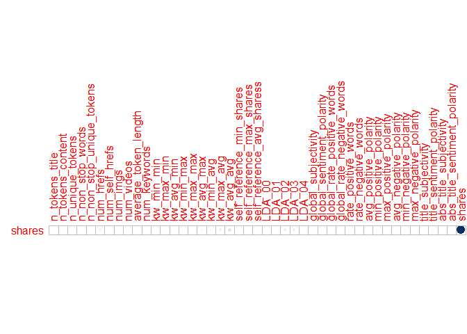

Project 2
================
Jackie Steffan
10/16/2020

# Required Packages

`tidyverse`

``` r
library(tidyverse)
```

    ## -- Attaching packages -------------------------------------------------------------------------------------------------------- tidyverse 1.3.0 --

    ## v ggplot2 3.3.2     v purrr   0.3.4
    ## v tibble  3.0.3     v dplyr   1.0.2
    ## v tidyr   1.1.2     v stringr 1.4.0
    ## v readr   1.3.1     v forcats 0.5.0

    ## -- Conflicts ----------------------------------------------------------------------------------------------------------- tidyverse_conflicts() --
    ## x dplyr::filter() masks stats::filter()
    ## x dplyr::lag()    masks stats::lag()

``` r
library(corrplot)
```

    ## corrplot 0.84 loaded

# Code for Automation

``` r
plot(pressure)
```

<!-- -->

# Introducation

This data set looks at articles that were published on the website
Mashable. The articles included were published over a 2 year period. The
goal of the data set was to look at the frequency of sharing and the
popularity of each article.

# Data

In this section I am reading in the data described above.  
I then separate the data into a training data set that contains 70% of
the data and a testing data set that contains the remaining 30% of the
data.

``` r
#read in data
popData <- read_csv("./OnlineNewsPopularity.csv")
```

    ## Parsed with column specification:
    ## cols(
    ##   .default = col_double(),
    ##   url = col_character()
    ## )

    ## See spec(...) for full column specifications.

``` r
# create train and test data sets
set.seed(5)
train <- sample(1:nrow(popData), size = nrow(popData)*0.7)
test <- dplyr::setdiff(1:nrow(popData), train)
popTrain <- popData[train, ]
popTest <- popData[test, ]
```

# Summarization

``` r
summary(popTrain)
```

    ##      url              timedelta     n_tokens_title  n_tokens_content
    ##  Length:27750       Min.   :  8.0   Min.   : 2.00   Min.   :   0.0  
    ##  Class :character   1st Qu.:164.0   1st Qu.: 9.00   1st Qu.: 245.0  
    ##  Mode  :character   Median :338.0   Median :10.00   Median : 408.0  
    ##                     Mean   :354.1   Mean   :10.39   Mean   : 544.8  
    ##                     3rd Qu.:542.0   3rd Qu.:12.00   3rd Qu.: 714.0  
    ##                     Max.   :731.0   Max.   :23.00   Max.   :8474.0  
    ##  n_unique_tokens    n_non_stop_words   n_non_stop_unique_tokens
    ##  Min.   :  0.0000   Min.   :   0.000   Min.   :  0.0000        
    ##  1st Qu.:  0.4711   1st Qu.:   1.000   1st Qu.:  0.6260        
    ##  Median :  0.5394   Median :   1.000   Median :  0.6908        
    ##  Mean   :  0.5562   Mean   :   1.008   Mean   :  0.6965        
    ##  3rd Qu.:  0.6095   3rd Qu.:   1.000   3rd Qu.:  0.7551        
    ##  Max.   :701.0000   Max.   :1042.000   Max.   :650.0000        
    ##    num_hrefs      num_self_hrefs       num_imgs         num_videos   
    ##  Min.   :  0.00   Min.   :  0.000   Min.   :  0.000   Min.   : 0.00  
    ##  1st Qu.:  4.00   1st Qu.:  1.000   1st Qu.:  1.000   1st Qu.: 0.00  
    ##  Median :  8.00   Median :  3.000   Median :  1.000   Median : 0.00  
    ##  Mean   : 10.91   Mean   :  3.276   Mean   :  4.575   Mean   : 1.23  
    ##  3rd Qu.: 14.00   3rd Qu.:  4.000   3rd Qu.:  4.000   3rd Qu.: 1.00  
    ##  Max.   :304.00   Max.   :116.000   Max.   :128.000   Max.   :91.00  
    ##  average_token_length  num_keywords    data_channel_is_lifestyle
    ##  Min.   :0.000        Min.   : 1.000   Min.   :0.00000          
    ##  1st Qu.:4.477        1st Qu.: 6.000   1st Qu.:0.00000          
    ##  Median :4.663        Median : 7.000   Median :0.00000          
    ##  Mean   :4.547        Mean   : 7.222   Mean   :0.05452          
    ##  3rd Qu.:4.853        3rd Qu.: 9.000   3rd Qu.:0.00000          
    ##  Max.   :8.042        Max.   :10.000   Max.   :1.00000          
    ##  data_channel_is_entertainment data_channel_is_bus data_channel_is_socmed
    ##  Min.   :0.0000                Min.   :0.0000      Min.   :0.00000       
    ##  1st Qu.:0.0000                1st Qu.:0.0000      1st Qu.:0.00000       
    ##  Median :0.0000                Median :0.0000      Median :0.00000       
    ##  Mean   :0.1764                Mean   :0.1588      Mean   :0.05946       
    ##  3rd Qu.:0.0000                3rd Qu.:0.0000      3rd Qu.:0.00000       
    ##  Max.   :1.0000                Max.   :1.0000      Max.   :1.00000       
    ##  data_channel_is_tech data_channel_is_world   kw_min_min       kw_max_min    
    ##  Min.   :0.0000       Min.   :0.0000        Min.   : -1.00   Min.   :     0  
    ##  1st Qu.:0.0000       1st Qu.:0.0000        1st Qu.: -1.00   1st Qu.:   447  
    ##  Median :0.0000       Median :0.0000        Median : -1.00   Median :   662  
    ##  Mean   :0.1836       Mean   :0.2106        Mean   : 26.22   Mean   :  1155  
    ##  3rd Qu.:0.0000       3rd Qu.:0.0000        3rd Qu.:  4.00   3rd Qu.:  1000  
    ##  Max.   :1.0000       Max.   :1.0000        Max.   :377.00   Max.   :298400  
    ##    kw_avg_min        kw_min_max       kw_max_max       kw_avg_max    
    ##  Min.   :   -1.0   Min.   :     0   Min.   :     0   Min.   :     0  
    ##  1st Qu.:  142.1   1st Qu.:     0   1st Qu.:843300   1st Qu.:173010  
    ##  Median :  235.4   Median :  1400   Median :843300   Median :244896  
    ##  Mean   :  313.5   Mean   : 13750   Mean   :752346   Mean   :259496  
    ##  3rd Qu.:  356.4   3rd Qu.:  7900   3rd Qu.:843300   3rd Qu.:331159  
    ##  Max.   :39979.0   Max.   :843300   Max.   :843300   Max.   :843300  
    ##    kw_min_avg     kw_max_avg       kw_avg_avg    self_reference_min_shares
    ##  Min.   :  -1   Min.   :     0   Min.   :    0   Min.   :     0.0         
    ##  1st Qu.:   0   1st Qu.:  3566   1st Qu.: 2388   1st Qu.:   638.2         
    ##  Median :1033   Median :  4364   Median : 2875   Median :  1200.0         
    ##  Mean   :1121   Mean   :  5682   Mean   : 3145   Mean   :  4002.4         
    ##  3rd Qu.:2062   3rd Qu.:  6021   3rd Qu.: 3611   3rd Qu.:  2700.0         
    ##  Max.   :3613   Max.   :298400   Max.   :37608   Max.   :843300.0         
    ##  self_reference_max_shares self_reference_avg_sharess weekday_is_monday
    ##  Min.   :     0            Min.   :     0             Min.   :0.0000   
    ##  1st Qu.:  1100            1st Qu.:   976             1st Qu.:0.0000   
    ##  Median :  2800            Median :  2200             Median :0.0000   
    ##  Mean   : 10198            Mean   :  6336             Mean   :0.1697   
    ##  3rd Qu.:  7900            3rd Qu.:  5181             3rd Qu.:0.0000   
    ##  Max.   :843300            Max.   :843300             Max.   :1.0000   
    ##  weekday_is_tuesday weekday_is_wednesday weekday_is_thursday weekday_is_friday
    ##  Min.   :0.0000     Min.   :0.0000       Min.   :0.0000      Min.   :0.0000   
    ##  1st Qu.:0.0000     1st Qu.:0.0000       1st Qu.:0.0000      1st Qu.:0.0000   
    ##  Median :0.0000     Median :0.0000       Median :0.0000      Median :0.0000   
    ##  Mean   :0.1841     Mean   :0.1862       Mean   :0.1808      Mean   :0.1462   
    ##  3rd Qu.:0.0000     3rd Qu.:0.0000       3rd Qu.:0.0000      3rd Qu.:0.0000   
    ##  Max.   :1.0000     Max.   :1.0000       Max.   :1.0000      Max.   :1.0000   
    ##  weekday_is_saturday weekday_is_sunday   is_weekend        LDA_00       
    ##  Min.   :0.00000     Min.   :0.00000   Min.   :0.000   Min.   :0.00000  
    ##  1st Qu.:0.00000     1st Qu.:0.00000   1st Qu.:0.000   1st Qu.:0.02505  
    ##  Median :0.00000     Median :0.00000   Median :0.000   Median :0.03341  
    ##  Mean   :0.06241     Mean   :0.07059   Mean   :0.133   Mean   :0.18615  
    ##  3rd Qu.:0.00000     3rd Qu.:0.00000   3rd Qu.:0.000   3rd Qu.:0.24446  
    ##  Max.   :1.00000     Max.   :1.00000   Max.   :1.000   Max.   :0.92699  
    ##      LDA_01            LDA_02            LDA_03            LDA_04       
    ##  Min.   :0.00000   Min.   :0.00000   Min.   :0.00000   Min.   :0.00000  
    ##  1st Qu.:0.02501   1st Qu.:0.02613   1st Qu.:0.02698   1st Qu.:0.02857  
    ##  Median :0.03335   Median :0.04000   Median :0.04000   Median :0.04073  
    ##  Mean   :0.14085   Mean   :0.21367   Mean   :0.22461   Mean   :0.23468  
    ##  3rd Qu.:0.15055   3rd Qu.:0.32421   3rd Qu.:0.37706   3rd Qu.:0.40045  
    ##  Max.   :0.92595   Max.   :0.92000   Max.   :0.92653   Max.   :0.92712  
    ##  global_subjectivity global_sentiment_polarity global_rate_positive_words
    ##  Min.   :0.0000      Min.   :-0.39375          Min.   :0.00000           
    ##  1st Qu.:0.3965      1st Qu.: 0.05816          1st Qu.:0.02840           
    ##  Median :0.4541      Median : 0.11896          Median :0.03906           
    ##  Mean   :0.4437      Mean   : 0.11954          Mean   :0.03966           
    ##  3rd Qu.:0.5091      3rd Qu.: 0.17801          3rd Qu.:0.05028           
    ##  Max.   :1.0000      Max.   : 0.72784          Max.   :0.15549           
    ##  global_rate_negative_words rate_positive_words rate_negative_words
    ##  Min.   :0.000000           Min.   :0.0000      Min.   :0.0000     
    ##  1st Qu.:0.009686           1st Qu.:0.6000      1st Qu.:0.1875     
    ##  Median :0.015385           Median :0.7097      Median :0.2800     
    ##  Mean   :0.016664           Mean   :0.6817      Mean   :0.2883     
    ##  3rd Qu.:0.021739           3rd Qu.:0.8000      3rd Qu.:0.3846     
    ##  Max.   :0.184932           Max.   :1.0000      Max.   :1.0000     
    ##  avg_positive_polarity min_positive_polarity max_positive_polarity
    ##  Min.   :0.0000        Min.   :0.00000       Min.   :0.0000       
    ##  1st Qu.:0.3063        1st Qu.:0.05000       1st Qu.:0.6000       
    ##  Median :0.3588        Median :0.10000       Median :0.8000       
    ##  Mean   :0.3541        Mean   :0.09582       Mean   :0.7565       
    ##  3rd Qu.:0.4114        3rd Qu.:0.10000       3rd Qu.:1.0000       
    ##  Max.   :1.0000        Max.   :1.00000       Max.   :1.0000       
    ##  avg_negative_polarity min_negative_polarity max_negative_polarity
    ##  Min.   :-1.0000       Min.   :-1.0000       Min.   :-1.0000      
    ##  1st Qu.:-0.3278       1st Qu.:-0.7000       1st Qu.:-0.1250      
    ##  Median :-0.2528       Median :-0.5000       Median :-0.1000      
    ##  Mean   :-0.2592       Mean   :-0.5207       Mean   :-0.1077      
    ##  3rd Qu.:-0.1863       3rd Qu.:-0.3000       3rd Qu.:-0.0500      
    ##  Max.   : 0.0000       Max.   : 0.0000       Max.   : 0.0000      
    ##  title_subjectivity title_sentiment_polarity abs_title_subjectivity
    ##  Min.   :0.0000     Min.   :-1.00000         Min.   :0.0000        
    ##  1st Qu.:0.0000     1st Qu.: 0.00000         1st Qu.:0.1667        
    ##  Median :0.1652     Median : 0.00000         Median :0.5000        
    ##  Mean   :0.2840     Mean   : 0.07186         Mean   :0.3403        
    ##  3rd Qu.:0.5000     3rd Qu.: 0.15000         3rd Qu.:0.5000        
    ##  Max.   :1.0000     Max.   : 1.00000         Max.   :0.5000        
    ##  abs_title_sentiment_polarity     shares      
    ##  Min.   :0.000000             Min.   :     4  
    ##  1st Qu.:0.000000             1st Qu.:   951  
    ##  Median :0.005682             Median :  1400  
    ##  Mean   :0.157117             Mean   :  3379  
    ##  3rd Qu.:0.250000             3rd Qu.:  2800  
    ##  Max.   :1.000000             Max.   :843300

``` r
cors <- cor(select(popTrain, -url, -starts_with("weekday_is")))
corrplot(cors, type = "upper", tl.pos = "lt")
```

<!-- -->

# Models

# Automation
